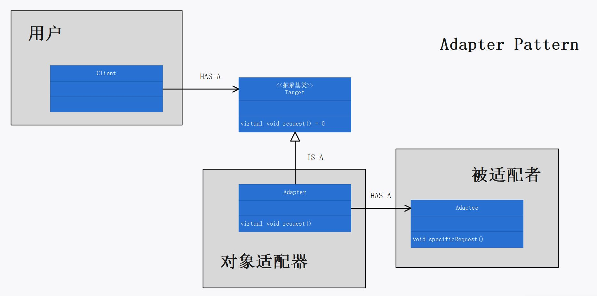

# 第七章：适配器模式

## 定义

将一个类的接口，转换成客户期望的另一个接口。适配器让原本接口不兼容的类可以合作无间。

## 使用场景

适配器的意图是转换接口。当新的类与旧的接口不兼容时，使用适配器转换接口，使其兼容。目的是将所有接口的变化封装在一个类中。客户调用的接口不变：

```cpp
WildTurkey wildTurkey;
TurkeyAdapter turkeyAdapter(&wildTurkey);

turkeyAdapter.quack();
turkeyAdapter.fly();
```

适配器将原接口实现为委托被适配者完成相应请求。

```cpp
Turkey* turkey;

void TurkeyAdapter::quack()
{
	this->turkey->gobble();
}

void TurkeyAdapter::fly()
{
	for (int i = 0; i < 5; i++)
	{
		this->turkey->fly();
	}
}
```

## 适配器模式的必要性和可行性

适配器可以使得客户使用的接口与实现类提供的接口兼容，这可以让客户从实现的接口解耦。 如果在一段时间之后，实现类想改变接口，适配器可以将改变的部分封装起来，客户就不必为了应对不同的接口而每次跟着修改。

当实现类接口可能改变时，需要使用适配器模式将客户与实现类解耦。若不使用适配器，则：

1. 客户的代码和实现绑定，因而客户和实现类耦合程度高。

2. 当实现类改变时，客户必须修改代码，以使用新的实现类接口。

若使用适配器模式，可以避免上述这两个问题：

1. 客户的代码和接口绑定，因而客户和实现类耦合程度低。

2. 客户调用的是适配器的接口，当实现类接口改变时，只需修改适配器的代码，使其兼容新的接口，客户无需修改代码。

## 设计理念

1. 适配器模式将客户和接口绑定起来，而不是和实现绑定起来。
2. 适配器模式将接口的改变封装在一个类中。
3. 客户和被适配者是解耦的，一个不知道另一个。即，适配器对于用户来说，是透明的。
4. 对象适配器使用组合来适配被适配者，类适配器继承被适配者和目标类。

## 设计原则


## UML 图

对象适配器的”理论“类图：p243



类适配器的”理论“类图：p244


## 代码解释

1. 本案例使用了对象适配器。目标类是 `Duck` ，客户调用 `Duck` 类的 `quack()` 和 `fly()` 接口；被适配者是 `Turkey` 类及其派生类；适配器是 `TurkeyAdapter` 类，适配器持有一个被适配者实例，并将接口实现为委托给其持有的被适配者实例的相关成员方法。
2. 装饰者模式、适配器模式、外观模式，三者形式相似，但是意图不同：适配器将一个对象包装起来以改变其接口；装饰者将一个对象包装起来以增加新的行为和责任；外观将一群对象”包装“起来以简化其接口。