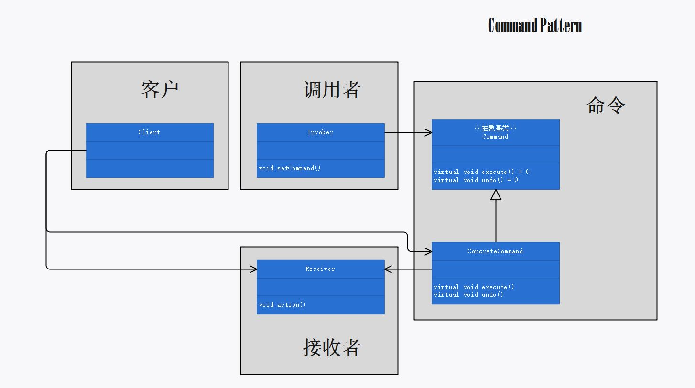

# 第六章：命令模式

## 定义

将“请求”封装成对象，以便使用不同的请求、队列或者日志来参数化其他对象。命令模式也可以支持撤销操作。

## 使用场景

当需要将发出请求的对象和执行请求的对象解耦时，可以使用命令模式。将“请求”封装成命令对象（即，将执行者执行“请求”的过程封装到命令对象的 `execute()` 方法中）：

```cpp
void LightOnCommand::execute()
{
	this->light->on();
}
```

调用者通过调用命令对象的 `execute()` 方法发出请求，间接使得接收者的动作被调用。

```cpp
void RemoteControl::onButtonWasPushed(int slot)
{
	this->onCommands[slot]->execute();
	this->lastCommand = this->onCommands[slot];
}
```

## 命令模式的必要性和可行性

不同的执行者执行请求的实现不同。若不使用命令模式。则：

1. 客户必须了解每一个执行者执行请求的逻辑，才能完成特定的任务，这将耗费客户很多的精力和资源。
2. 客户使用“硬编码”调用各执行者的方法，使得客户和执行者之间的耦合程度过高，无法实现动态绑定，不易于代码维护。

使用命令模式可以避免上述两个弊端：

1. 客户无需了解各个执行者执行请求的逻辑，将这项任务交给命令对象去做。由命令对象去了解特定执行者的业务逻辑，并将请求执行的过程封装到命令对象中。这个命令对象甚至可以由执行者厂家负责编写。
2. 所有的命令对象都用相同的超类，并具有统一的接口。客户可以通过“组合”的方式，动态绑定需要的命令对象。通过命令对象，将发出请求的对象和执行请求的对象解耦（即，将命令对象作为发出请求的对象和执行请求的对象间沟通的桥梁）。

## 设计理念

1. 命令对象通过在特定的接收者上绑定一组动作来封装一个请求。即，将执行者执行“请求”的过程封装到命令对象的 `execute()` 方法中，调用者通过调用命令对象的 `execute()` 方法发出请求，间接使得接收者的动作被调用。

2. 调用者可以持有（即“组合”）多个不同的命令对象，客户使用调用者调用命令对象。

3. 若某个“请求”需要多个命令对象协作完成，客户可以创建一个宏命令对象（本质也是一个命令对象）。其中宏命令对象的 `execute()` 方法会按逻辑调用其“组合”的其他命令对象的 `execute()` 方法。封装宏命令的实现方式，比创建一个专用的命令对象并硬编码实现的方式更灵活。

4. 可以支持“请求”的撤销，做法是在命令对象中实现一个 `undo()` 方法来回到 `execute()` 方法被执行前的状态。

5. 在效果上，“接收者“的存在不是必须的，命令对象可以直接实现 `execute()` 方法的细节：

   ```cpp
   void GarageDoorUpCommand::execute()
   {
   	cout << "车库大门打开" << endl;
   }
   ```

   效果上虽然相同，但是接收者的引入使得命令对象和硬件之间的耦合程度更低。

## 设计原则


## UML 图

命令模式的“理论”类图：p207



命令模式的“案例”类图：p215


## 代码解释

1. 为便于管理内存，将 `Command * noCommand` 声明一个为成员变量。


2. 通过在调用者中维护一个命令对象栈，可以实现多次撤销以撤回到较早的状态。（本案例未实现此功能）、
3. 相比于创建一个 `PartyOnCommand` 类，把开派对请求硬编码到 `PartyOnCommand` 类的 `execute()` 方法中，更推荐使用类似于本案例的，封装宏命令的实现方式。因为利用宏命令，可以动态地决定 `PartyOnCommand` 是由哪些命令组成，所以宏命令在使用上更灵活。

