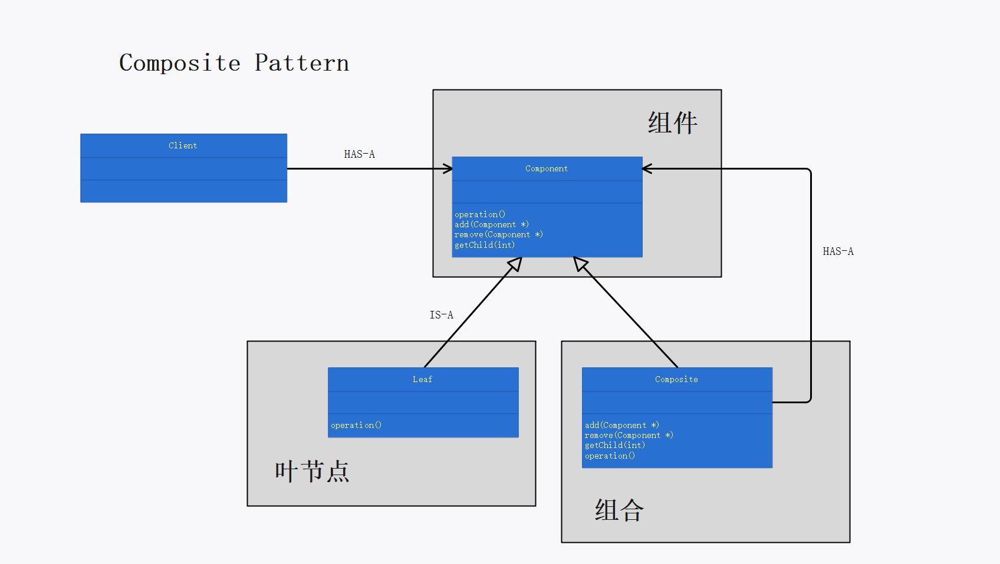
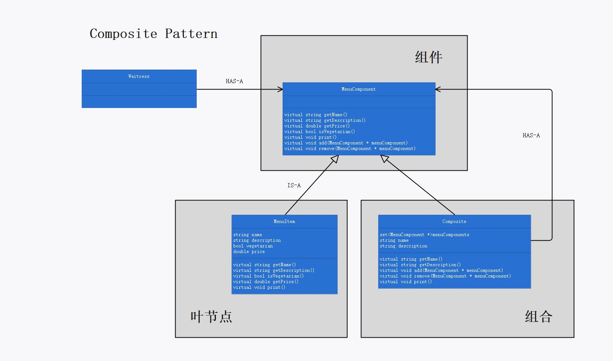

# 第九章：组合模式

## 定义

允许你将对象组合成树形结构来表现”整体/部分“层次结构。组合能让客户以一致的方式处理个别对象以及对象组合。

## 使用场景

当客户需要以相同的方式统一处理个别对象和组合对象时，可使用组合模式。

在树形结构中，个别对象作为叶节点，组合对象作为一般节点。个别对象和组合对象具有相同的超类（此时继承的目的在于类型匹配）：

```cpp
//超类：组件
class MenuComponent
{
public:
	virtual string getName();
	virtual string getDescription();
	virtual double getPrice();
	virtual bool isVegetarian();
	virtual void print();
	virtual void add(MenuComponent * menuComponent);
	virtual void remove(MenuComponent * menuComponent);
	virtual ~MenuComponent();
};

//个别对象
class MenuItem :public MenuComponent
{
private:
	string name;
	string description;
	bool vegetarian;
	double price;
public:
	MenuItem(string name, string description, bool vegetarian, double price);
	virtual string getName();
	virtual string getDescription();
	virtual bool isVegetarian();
	virtual double getPrice();
	virtual void print();
	~MenuItem();
};

//组合对象
class Menu :public MenuComponent
{
private:
	set<MenuComponent *>menuComponents;
	string name;
	string description;
public:
	Menu(string name, string description);
	virtual string getName();
	virtual string getDescription();
	virtual void add(MenuComponent * menuComponent);
	virtual void remove(MenuComponent * menuComponent);
	virtual void print();
	~Menu();
};
```

用户使用基类（组件）指针，可以忽略组合对象和个别对象之间的差别，多态地调用相同的接口：

```cpp
MenuComponent * allMenus;

void Waitress::printMenu()
{
	this->allMenus->print();
}
```

使用组合结构，用户可以把相同的操作应用在组合和个别对象上，而无需关系操作的对象究竟是组合对象还是个别对象。

## 组合模式的必要性和可行性

当客户需要统一处理具有”整体/部分“层次结构的对象（这个”对象“可能是个别的对象也可能是对象的集合）时，需要使用组合模式。

若不使用组合模式，用户在对对象进行操作前，必须判断对象类型到底是组合对象还是个别对象，并对二者分别进行不同的操作，这失去了透明性。

使用组合模式，由于个别对象和组合对象继承自相同的超类，因而具有相同的接口。用户可以在二者上调用该接口，而无需关心操作的对象究竟是组合对象还是个别对象，从而实现了”统一处理“个别对象和组合对象，使得一个元素究竟是组合还是叶节点对客户是透明的。

## 设计理念

1. 组合模式的意义在于透明性：组合模式使得客户可以统一处理个别对象和组合对象。在大多数情况下，客户可以忽略个别对象和组合对象之间的差别，将对象的集合以及个别的对象一视同仁。
2. 组件的角色是为叶节点和组合节点提供一个共同的接口，此时继承的目的在于类型匹配。
3. 使用组合模式组织数据时，最终会得到一个由上而下的树形结构，树的根部是一个组合，而组合的分支逐渐往下延伸，直到叶节点为止。（注：组合和叶节点都继承自组件超类）
4. 组合模式以单一责任设计原则换取透明性，同时也是安全性和透明性的折衷。

## 设计原则


## UML 图

组合模式的“理论”类图：p358



组合模式的“案例”类图：p359



## 代码解释

1. 组合模式是安全性和透明性的折衷。
   * 使用组合模式时，由于在超类（组件类）中同时具有两种类型的操作（个别对象的操作和组合对象的操作），因而客户有机会对一个元素做一些不恰当或是没有意义的操作（例如对个别对象进行组合对象的操作，或者对组合对象进行个别对象的操作），从而失去了”安全性“。
   * 使用组合模式使得客户无需动态判断操作的对象究竟是个别对象还是组合对象，从而将元素的类型对客户透明，获得了”透明性“。

2. try/catch是一种错误处理的方法，不应该是程序逻辑的方法。