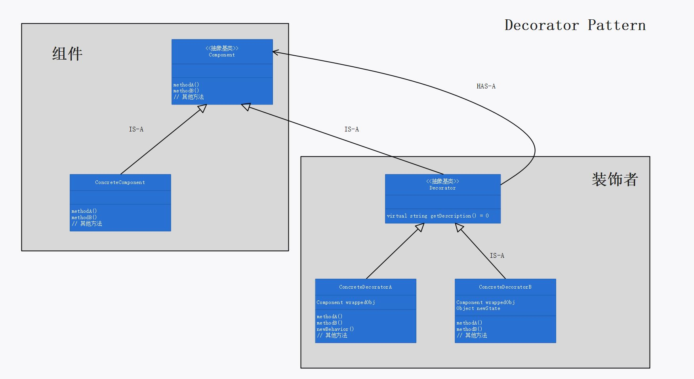
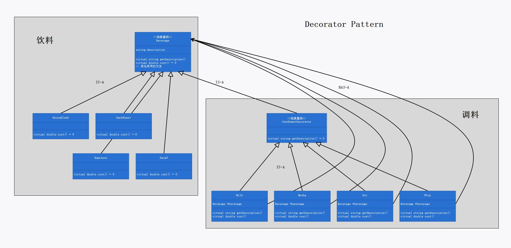

# 第三章：装饰者模式

## 定义

动态地将责任附加到对象上。若要拓展功能，装饰者提供了比继承更有弹性的替代方案。

## 使用场景

当需要动态地扩展某（已有）组件的功能时，可使用装饰者模式：

令装饰者和被装饰对象有相同的超类型，在装饰者中维护一个类型为该超类型指针的变量。则装饰者可以在所委托被装饰者的行为之前/或之后，加上自己的行为，以达到特定的目的。

```cpp
Beverage *beverage;

double Milk::cost()
{
	return this->beverage->cost() + 0.1;
}
```

## 装饰者模式的必要性和可行性

当需要扩展某组件的功能时，若采用一般的硬编码方法，会面临“类爆炸”，且每次扩展组件的功能都需要修改代码，无法做到“对修改关闭”。

1. 由于对不同的组件需要扩展出许多不同的功能，采用硬编码一一枚举，众多的组合方式要求使用大量相似而又各不相同的类，这会造成“类爆炸”。
2. 由于无法将变化的部分与不变的部分分割开来，当需要扩展某组件的功能时，或当需要改变功能的组合方式时，需要修改已有的代码，无法做到“对修改关闭”。

若使用策略模式，可以避免上述这两个问题：

1. 为每个组件和每个功能各设计一个类，则不同的“组件 + 功能”的组合可用其对应的类的组合实现，而无需为每种组合设计一个类，这样可以大幅减少需要的类的数量。
2. 组件和功能的内部实现是不变的部分，组件和功能的组合方式是变化的部分。通过将变化的部分与不变的部分分割开来，可以做到组件功能的动态扩展，而无需修改已有的代码，做到了“对扩展开放，对修改关闭”。

## 设计理念

1. 通过动态地组合对象，可以写新的代码添加新功能，而无须修改现有代码。
2. 装饰者可以在所委托被装饰者的行为之前/或之后，加上自己的行为，以达到特定的目的。
3. 装饰者的类型“反映”了它所装饰的对象。所谓“反映”，指的就是两者类型一致。这通过令装饰者和被装饰对象有相同的超类型实现。关键理念是：利用继承达到”类型匹配“，而不是利用继承获得”行为“。继承的目的是”类型匹配“，而不是获得”行为“；行为来自装饰者和基础组件/或其他装饰者之间的组合关系。
4. 被装饰对象可以是基础组件，也可以是另一个装饰者。因为类型是匹配的。

## 设计原则

1. 类应该对扩展开放，对修改关闭。

## UML 图

装饰者模式的“理论”类图：p91



装饰者模式的“案例”类图：p92



## 代码解释

1. `Beverage` 中的 `getDescription()` 方法必须声明为虚函数。否则，当被装饰对象也是某个装饰者时，由于外层装饰者使用 `Beverage *beverage` 指针指向被装饰对象（实际是另一个装饰者），若 `Beverage` 中的 `getDescription()` 方法未定义为虚函数，则 `this->beverage->getDescription()` 会调用 `Beverage` 类的 `getDescription()` 方法，而不是被装饰对象（内层装饰者）的 `getDescription()` 方法。即使 `CondimentDecorator` 类将 `getDescription()` 方法声明为虚函数，也无法实现多态。

2. 有关 `size` 的部分，是考虑了咖啡具有不同容量的情况，参考 p107 习题解答。注：每个装饰者应将其自身的 `size` 属性值置为其指向的被装饰对象的 `size` 属性值：

   ```cpp
   Milk::Milk(Beverage * beverage) :CondimentDecorator()
   {
   	this->beverage = beverage;
   	this->size = this->beverage->getSize();
   }
   ```

   因为添加调料后的饮料容量应该与原饮料的容量相同。