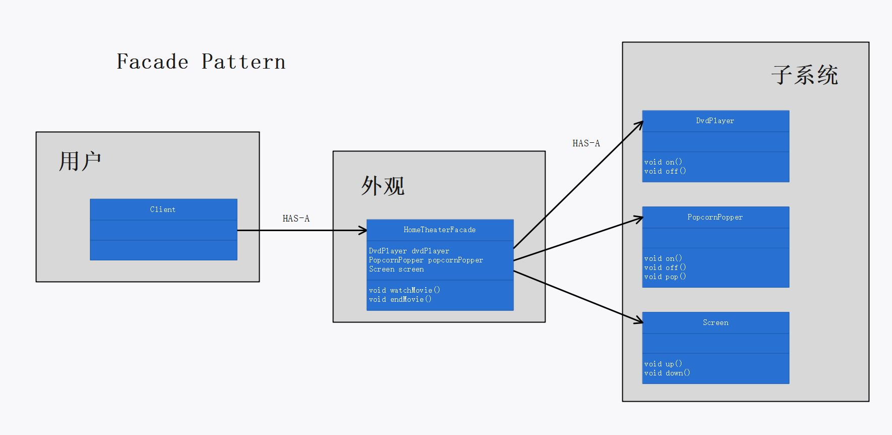

# 第七章：外观模式

## 定义

提供了一个统一的接口，用来访问子系统中的一群接口。外观定义了一个高层接口，让子系统更容易使用。

## 使用场景

外观模式的目的是提供一个简单的接口，让子系统更易于使用。当需要一个方便的接口使用子系统时，可以使用外观模式。

```cpp
HomeTheaterFacade homeTheaterFacade;
homeTheaterFacade.watchMovie();
homeTheaterFacade.endMovie();

class HomeTheaterFacade
{
private:
	DvdPlayer dvdPlayer;
	PopcornPopper popcornPopper;
	Screen screen;
public:
	void watchMovie()
	{
		this->popcornPopper.on();
		this->popcornPopper.pop();
		this->screen.down();
		this->dvdPlayer.on();
	}
	void endMovie()
	{
		this->popcornPopper.off();
		this->screen.up();
		this->dvdPlayer.off();
	}
};
```

## 外观模式的必要性和可行性

外观模式不只是简化了接口，也将客户从组件的子系统中解耦。如果客户代码时针对外观而不是针对子系统编写的，当子系统升级并采用了和之前不同的接口组件时，客户无需改变代码。只需要修改外观代码即可。

## 设计理念

1. 外观没有”封装“子系统的类，只是提供了简化的接口。这是外观模式一个很好的特征：提供简化的接口的同时，依然将系统完整的功能暴露出来，以供需要的人使用。
2. 外观模式让客户和子系统之间避免紧耦合，即外观将客户从一个复杂的子系统中解耦。
3. 一个子系统可以实现一个以上的外观。

## 设计原则

1. 只和你的密友交谈。

## UML 图

p269



## 代码解释

1. 实现一个外观，需要将子系统组合进外观中，然后将工作委托给子系统执行。
2. 装饰者模式、适配器模式、外观模式，三者形式相似，但是意图不同：适配器将一个对象包装起来以改变其接口；装饰者将一个对象包装起来以增加新的行为和责任；外观将一群对象”包装“起来以简化其接口。