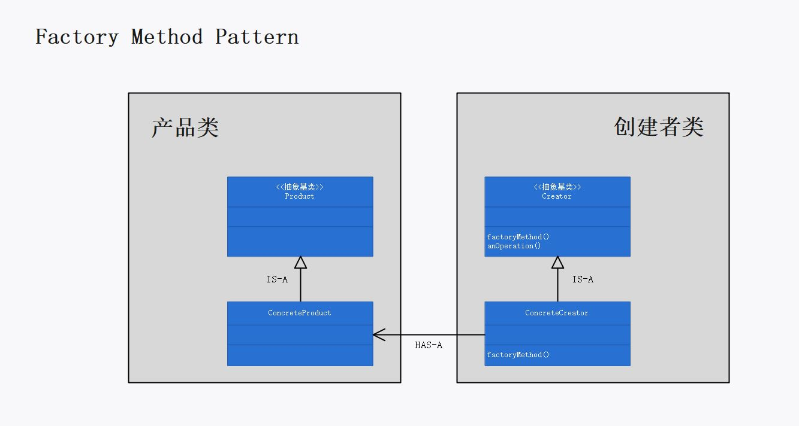
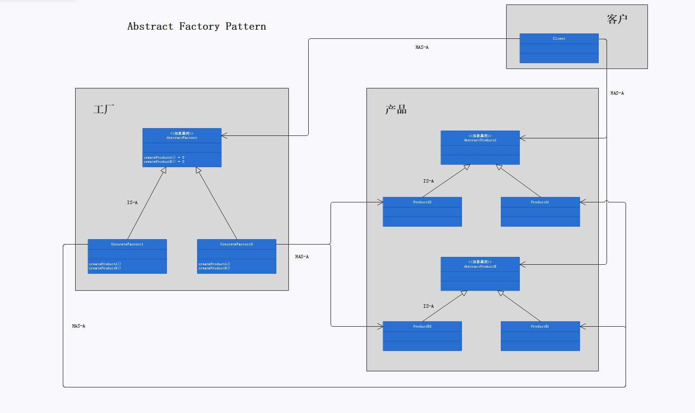
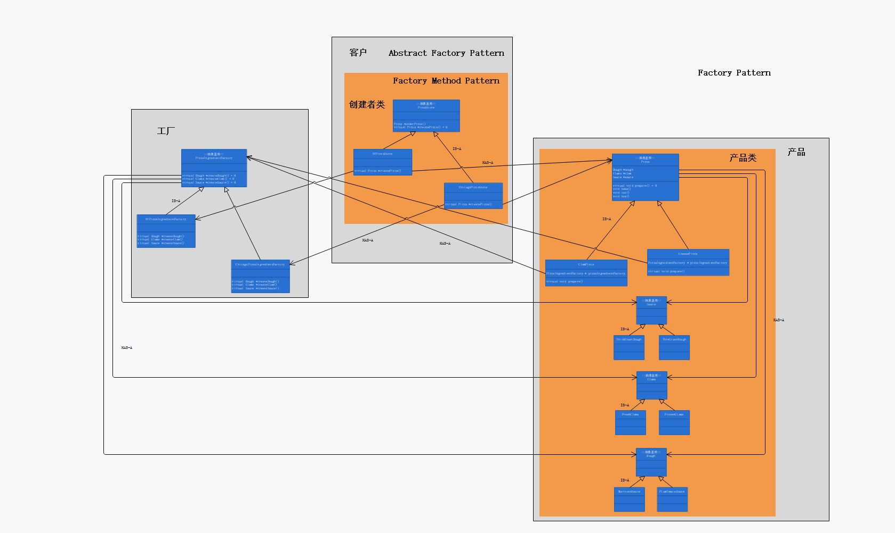

# 第四章：工厂模式

## 定义

工厂模式包含两部分：

+ 工厂方法模式：

  定义了一个创建对象的接口，但由子类决定要实例化的类是哪一个。工厂方法让类把实例化推迟到子类。

+ 抽象工厂模式：

  提供一个接口，用于创建相关或依赖对象的家族，而不需要明确指定具体类。

## 使用场景

当需要把对象的创建过程封装起来时，可使用工厂模式。两种工厂模式都可以封装对象的创建，但封装方式不同，因而使用方式也不同：

* 工厂方法模式：

  * 封装方式：

    工厂方法使用继承：把对象的创建委托给子类，子类实现工厂方法来创建对象。不同的子类，其工厂方法的实现方式不同，因而会创建出不同的对象；但是这些不同的子类创建出的不同的对象具有相同的超类。

  * 使用方式：

    用户维护一个类型为基类的指向子类的指针 `Creator *`，这个基类中既声明了工厂方法，又声明了非工厂方法（一般情况下：客户使用非工厂方法，而非工厂方法会调用工厂方法创建对象，并操作这些对象）。使用时，用户令 `Creator *` 指针指向不同的子类实例，由于指向的子类实例不同，工厂方法会创建出不同的对象，因而非工厂方法操作的对象也不同，从而实现多态。

    工厂方法模式可以实现：客户可以使用相同的接口（`Creator *` 指针指向的非工厂方法），对不同的对象进行相同的操作（这个操作指非工厂方法的动作内容），其中实际操作的对象类型由 `Creator *` 指针指向的是哪个子类实例决定。

    多态体现在：用户使用的非工厂方法的接口是不变的，但是非工厂方法实际操作的对象是变化的，这个变化是在运行期决定的。

  * 实际案例：

    本例中，用户是 `main()` 函数，用户维护的类型为 `PizzaStore *` 的指针指向了不同的子类实例：

    ```cpp
    PizzaStore *nyPizzaStore = new NYPizzaStore;
    PizzaStore *chicagoPizzaStore = new ChicagoPizzaStore;
    ```

    这个基类 `PizzaStore` 中包含了非工厂方法 `Pizza *orderPizza(string type);` 和工厂方法 `virtual Pizza *createPizza(string type) = 0;`；

    不同的子类，其工厂方法的实现不同：

    ```cpp
    // NYPizzaStore 子类工厂方法的实现
    Pizza * NYPizzaStore::createPizza(string type)
    {
    	Pizza *pizza = nullptr;
    	PizzaIngredientFactory * pizzaIngredientFactory = new NYPizzaIngredientFactory;
    	if (type == "clam")
    	{
    		pizza = new ClamPizza(pizzaIngredientFactory);
    		pizza->setName("NYPizzaStore 使用 NYPizzaIngredientFactory 的原料生产的 ClamPizza");
    	}
    	else if (type == "cheese")
    	{
    		pizza = new CheesePizza(pizzaIngredientFactory);
    		pizza->setName("NYPizzaStore 使用 NYPizzaIngredientFactory 的原料生产的 CheesePizza");
    	}
    	return pizza;
    }
    
    // ChicagoPizzaStore 子类工厂方法的实现
    Pizza * ChicagoPizzaStore::createPizza(string type)
    {
    	Pizza *pizza = nullptr;
    	PizzaIngredientFactory * pizzaIngredientFactory = new ChicagoPizzaIngredientFactory;
    	if (type == "clam")
    	{
    		pizza = new ClamPizza(pizzaIngredientFactory);
    		pizza->setName("ChicagoPizzaStore 使用 ChicagoPizzaIngredientFactory 的原料生产的 ClamPizza");
    	}
    	else if (type == "cheese")
    	{
    		pizza = new CheesePizza(pizzaIngredientFactory);
    		pizza->setName("ChicagoPizzaStore 使用 ChicagoPizzaIngredientFactory 的原料生产的 CheesePizza");
    	}
    	return pizza;
    }
    ```

    在非工厂方法 `Pizza *orderPizza(string type);` 中，调用了工厂方法 `virtual Pizza *createPizza(string type) = 0;` 创建对象，并对创建出的对象进行操作：

    ```cpp
    Pizza * PizzaStore::orderPizza(string type)
    {
    	Pizza *pizza = this->createPizza(type);
    	pizza->prepare();
    	pizza->bake();
    	pizza->cut();
    	pizza->box();
    	return pizza;
    }
    ```

    由于实现工厂方法 `virtual Pizza *createPizza(string type) = 0;` 的子类实例不同，创建出的对象也是不同的。

    使用时，用户使用非工厂方法 `Pizza *orderPizza(string type);` ：

    ```cpp
    pizza = nyPizzaStore->orderPizza("clam");
    pizza = chicagoPizzaStore->orderPizza("clam");
    ```

    虽然用户调用了相同的接口，但是接口的“行为”却因子类实例的不同而不同。

* 抽象工厂模式：

  * 封装方式：

    抽象工厂使用对象组合：对象的创建被实现在工厂接口所暴露出来的方法中。基类声明了工厂接口，对象的创建在工厂接口的实现中完成。子类负责实现这些工厂接口，不同的子类，工厂接口的实现不同，因而创建出的对象也不同；但是这些不同的子类创建出的不同的对象具有相同的超类。不同的子类实例，可以创建出不同的对象家族。

  * 使用方式：

    用户维护一个类型为基类的指向子类的指针 `AbstractFactory *`，这个基类中声明了工厂接口。使用时，用户令 `AbstractFactory *` 指针指向不同的子类实例，由于指向的子类实例不同，工厂接口会创建出不同的对象，从而实现多态。若工厂接口会创建出多个对象，我们成这组对象为一个家族。即，每个子类实例都会创建出一个不同的产品家族（不同的产品家族可能包含相同类型的对象），不同产品家族间的关系是平行的。

    抽象工厂可以实现：客户可以使用相同的接口（`AbstractFactory *` 指针指向的工厂接口），创建出不同的产品家族，具体创建出的产品家族的内容（即包括哪些对象类型）由`AbstractFactory *` 指针指向的是哪个子类实例决定。

    多态体现在：用户使用的工厂接口是不变的，但是实际创建出的产品家族（对象类型）是变化的，这个变化是在运行期决定的。

  * 实际案例：

    本例中，用户是 `ClamPizza` 类或 `CheesePizza` 类，用户维护的类型为 `PizzaIngredientFactory *` 的指针指向了不同的子类实例：
  
    ```cpp
    class ClamPizza :public Pizza
    {
    public:
    	ClamPizza(PizzaIngredientFactory * pizzaIngredientFactory) :Pizza()
        {
            this->pizzaIngredientFactory = pizzaIngredientFactory;
        }
    private:
    	PizzaIngredientFactory * pizzaIngredientFactory;
    	virtual void prepare();
    };
    
    Pizza *pizza = new ClamPizza(new NYPizzaIngredientFactory);
    ```
  
    这个 `PizzaIngredientFactory` 基类中声明了三个工厂接口：
  
    ```cpp
    virtual Dough *createDough() = 0;
    virtual Clams *createClam() = 0;
    virtual Sauce *createSauce() = 0;
    ```
  
    不同的子类，其工厂接口的实现不同：
  
    ```cpp
    // NYPizzaIngredientFactory 子类工厂接口的实现
    Dough * NYPizzaIngredientFactory::createDough()
    {
    	cout << "NYPizzaIngredientFactory：取得了 ThinCrustDough" << endl;
    	return new ThinCrustDough;
    }
    Clams * NYPizzaIngredientFactory::createClam()
    {
    	cout << "NYPizzaIngredientFactory：取得了 FreshClams" << endl;
    	return new FreshClams;
    }
    Sauce * NYPizzaIngredientFactory::createSauce()
    {
    	cout << "NYPizzaIngredientFactory：取得了 MarinaraSauce" << endl;
    	return new MarinaraSauce;
    }
    
    // ChicagoPizzaIngredientFactory 子类工厂接口的实现
    Dough * ChicagoPizzaIngredientFactory::createDough()
    {
    	cout << "ChicagoPizzaIngredientFactory：取得了 ThickCrustDough" << endl;
    	return new ThickCrustDough;
    }
    Clams * ChicagoPizzaIngredientFactory::createClam()
    {
    	cout << "ChicagoPizzaIngredientFactory：取得了 FrozenClams" << endl;
    	return new FrozenClams;
    }
    Sauce * ChicagoPizzaIngredientFactory::createSauce()
    {
    	cout << "ChicagoPizzaIngredientFactory：取得了 PlumTomatoSauce" << endl;
    	return new PlumTomatoSauce;
    }
    ```
  
    由于不同的子类，其工厂接口的实现不同，因而不同子类可以创建出不同的产品家族。
  
    使用时，用户通过调用工厂接口获得一个产品家族：
  
    ```cpp
    void ClamPizza::prepare()
    {
    	cout << "ClamPizza：准备 " << this->getName() << endl;
    	this->dough = this->pizzaIngredientFactory->createDough();
    	this->sauce = this->pizzaIngredientFactory->createSauce();
    	this->clam = this->pizzaIngredientFactory->createClam();
    }
    ```
  
    虽然用户调用了相同的接口，但是接口的“行为”却因子类实例的不同而不同。
  
* 注：”继承“或是”组合“，是从客户的视角审视的。即，客户通过继承的方式使用工厂方法；客户通过组合的方式使用抽象工厂。本例中，客户分别是 `main()` 函数和 `ClamPizza` 类/ `CheesePizza` 类。

##  工厂模式的必要性和可行性

当需要创建某个类的实例时，若直接使用 `new` ，是在针对实现编程，而没有针对接口编程。代码绑着具体类会导致代码缺乏弹性，不易维护。因为当需要创建的对象变化或者扩展时，必须重新修改代码，无法做到”对修改关闭“。

若代码时针对接口编写，那么通过多态，它可以与任何新类实现该接口。一旦加入新的具体类时，无需修改现有接口。可以做到”对修改关闭，对扩展开放“。

## 设计理念

1. 用工厂（factory）处理创建对象的细节。工厂模式将对象创建的过程封装起来，以便将代码从具体类解耦（将客户程序从具体类解耦）。通过减少应用程序和具体类之间的依赖促进松耦合。
2. 使用工厂模式意味着客户在实例化对象时，只会依赖于接口，而不是具体类。使得程序针对接口编程，而不针对实现编程。这可以让代码更具有弹性，可以应对未来的扩展。
3. 抽象工厂模式中，具体工厂经常通过实现工厂方法来创建他们的产品。

## 设计原则

1. 要依赖抽象，不要依赖具体类。

## UML 图

工厂方法模式的“理论”类图：p134



抽象工厂模式的“理论”类图：p156



工厂模式的“案例”类图：p160-161



## 代码解释

1. 由于在一个案例中体现了两种工厂模式（工厂方法模式，抽象工厂模式），因而代码比较复杂。宏观上看，工厂方法模式体现在比萨下订单阶段，涉及到 `Pizza` 类及其子类、 `PizzaStore` 类及其子类；抽象工厂模式体现在比萨的原材料准备阶段，涉及到 `Pizza` 类及其子类、`PizzaIngredientFactory` 类及其子类以及各种原料类。

2. 不要忘了 `delete` ，防止内存泄露。基类应该使用虚析构。