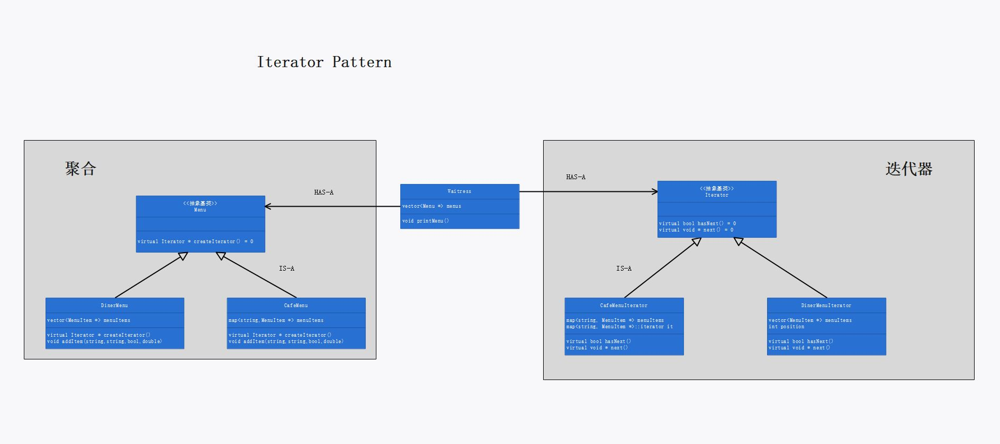

# 第九章：迭代器模式

## 定义

提供一种方法顺序访问一个聚合对象中的各个元素，而又不暴露其内部的表示。

## 使用场景

当想要遍历聚合对象中的元素（在元素间游走）时，可使用迭代器模式：

主题维护一个观察者集合，这些观察者都实现了 update() 接口，当主题想要通知观察者时，遍历观察者集合，调用每个观察者的 `update()` 方法。

```cpp
set<Observer *> observers;

void WeatherData::measurementsChanged()
{
	this->notifyObservers();
}

void WeatherData::notifyObservers()
{
	for_each(this->observers.begin(), this->observers.end(), [&](Observer *o) {
		o->update(this, this->dm);
	});
}
```

迭代器的引入可以使得用户在访问聚合对象中的元素时无需关心数据的具体存储方式；同时，用户针对聚合及迭代器的接口编程，而非针对具体聚合类的实现编程，可以将用户与具体聚合对象解耦，并提高聚合类的内聚程度（即高内聚、低耦合）。

## 迭代器模式的必要性和可行性

当需要遍历聚合变量时，应该使用迭代器模式，针对迭代器的接口进行遍历；不应该使用硬编码的方式针对特定的聚合实现进行遍历。如果不使用迭代器模式遍历聚合对象，下列两种实现方式均存在问题：

1. 若硬编码直接在特定的对象实例上遍历，无法实现多态，后期维护困难，且违反了“针对接口编程，不针对实现编程”、“对修改关闭，对扩展开放”的面向对象设计原则；

2. 若令聚合类实现统一的遍历接口如

   ```cpp
   class MenuWithForEach
   {
   public:
   	virtual bool hasNext() = 0;
   	virtual void * next() = 0;
   	virtual ~MenuWithForEach() {}
   };
   
   class DinerMenu :public MenuWithForEach
   {
   private:
   	static int MAX_ITEMS;
   	vector<MenuItem *> menuItems;
   public:
   	DinerMenu();
   	void addItem(string name, string description, bool vegetarian, double price);
     virtual bool hasNext();
   	virtual void * next();
   	~DinerMenu();
   };
   ```

   虽然用户在使用时可以对 `MenuWithForEach` 接口编程，但是聚合类 `DinerMenu` 内聚程度较低：它既需要提供储存数据的服务，还需要提供遍历数据的服务，这不满足“一个类应该只有一个引起变化的原因”原则。当遍历数据的方式需要调整或增加例如 `remove()` 的方法时，需要打开这个聚合类进行修改。其原因在于 `DinerMenu` 这个类具有不止一个责任，应该让一个类只具有一个责任。

若使用迭代器模式，通过引入迭代器类，可以避免上述两个问题：

1. 由于不同的具体迭代器都继承自相同的超类 `Iterator` ，因而具有相同的接口。这使得用户可以对 `Iterator` 接口编程，从而可以编写多态的代码和不同的聚合类搭配，而不用关心该聚合类存储数据的方式，这遵循了“针对接口编程，不针对实现编程”的面向对象设计原则；当用户选用不同的聚合类存储数据时，可以实现动态插拔，遵循了“对修改关闭，对扩展开放”的原则。
2. 使用具体迭代器遍历具体聚合，将遍历数据的责任转交给迭代器，因而聚合类只需负责存储数据即可，提高了聚合类的内聚程度。当遍历需求改变时，只需修改具体迭代器，而无需修改具体聚合类，遵循了“一个类应该只有一个引起变化的原因”的原则。

## 设计理念

1. 聚合类只负责存储数据，由迭代器类负责遍历数据（在元素之间游走）。
2. 用户使用抽象聚合以及抽象迭代器，可以实现多态。
3. 由具体聚合类负责创建（可以在其内部存储的元素间游走的）具体迭代器类。

## 设计原则

1. 一个类应该只有一个引起变化的原因。

## UML 图

p56



## 代码解释

1. range-based for loop 是 c++ 11 中新加入的特性，若想修改容器内的数据，必须将循环变量声明为引用：

   ```cpp
   //声明为引用时，操作的是容器中的变量
   DinerMenu::~DinerMenu()
   {
   	cout << "~DinerMenu" << endl;
   
   	cout <<"真值地址："<< &(this->menuItems[0]) <<'\n'<< endl;
   
   	for (MenuItem * &menuItem : this->menuItems)
   	{
   		delete menuItem;
   		menuItem = nullptr;
   		cout << "循环变量地址：" << &menuItem << endl;
   	}
   }
   
   //输出
   ~DinerMenu
   真值地址：00A9F1F8
   
   ~MenuItem
   循环变量地址：00A9F1F8
   ~MenuItem
   循环变量地址：00A9F1FC
   ~MenuItem
   循环变量地址：00A9F200
   ~Menu
   
   //不声明为引用时，操作的是容器中的变量的副本（本例容器中存放的是指针，若容器中存放的是对象本身，则生成副本时会调用该对象的拷贝构造函数）
   DinerMenu::~DinerMenu()
   {
   	cout << "~DinerMenu" << endl;
   
   	cout <<"真值地址："<< &(this->menuItems[0]) <<'\n'<< endl;
   
   	for (MenuItem * menuItem : this->menuItems)
   	{
   		delete menuItem;
   		menuItem = nullptr;
   		cout << "循环变量地址：" << &menuItem << endl;
   	}
   }
   
   //输出
   ~DinerMenu
   真值地址：0094DAF0
   
   ~MenuItem
   循环变量地址：0055FC48
   ~MenuItem
   循环变量地址：0055FC48
   ~MenuItem
   循环变量地址：0055FC48
   ~Menu
   ```

   