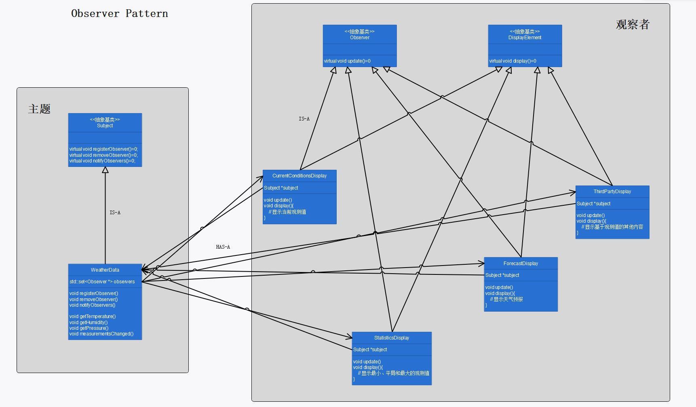

# 第二章：观察者模式

## 定义

定义了对象之间的一对多依赖，这样一来，当一个对象改变状态时，它的所有依赖者都会收到通知并自动更新。

## 使用场景

当多个对象想观察某个对象的变化时，可使用观察者模式：

主题维护一个观察者集合，这些观察者都实现了 update() 接口，当主题想要通知观察者时，遍历观察者集合，调用每个观察者的 `update()` 方法。

```cpp
set<Observer *> observers;

void WeatherData::measurementsChanged()
{
	this->notifyObservers();
}

void WeatherData::notifyObservers()
{
	for_each(this->observers.begin(), this->observers.end(), [&](Observer *o) {
		o->update(this, this->dm);
	});
}
```

## 观察者模式的必要性和可行性

当多个观察者对象想监听某个主题对象的变化时，若由主题对象本身通过硬编码调用观察者对象的方法去推送数据，则会破坏主题对象的封装性，且无法做到观察者的动态插拔，不易于代码维护：

硬编码实现

```cpp
void WeatherData::measurementsChanged()
{
	currentConditionsDisplay.update(this->dm);
  	statisticsDisplay.update(this->dm);  
}
```

1. `void WeatherData::measurementsChanged()` 是主题对象在测量值变化时调用的函数，是不变的部分；观察者 update() 方法的调用是变化的部分（因为观察者可能会改变）；因而需要将变化的部分封装起来，否则会破坏主题对象的封装性。
2. 将特定的观察者写在主题 `measurementsChanged()` 方法的内部无法动态增加或删除观察者。
3. 针对具体实现编程，导致以后在增加或删除观察者时，必须修改程序，不易于代码维护。

若使用观察者模式，可以避免上述这三个问题：

1. `update()` 方法是变化的部分，将其封装在 `notifyObservers()` 中调用。当观察者部分需要修改时（增加/删除观察者），不用更改 `measurementsChanged()` 方法，保护了主题对象的封装性。
2. 主题中维护一个观察者集合，可以做到观察者的动态插拔。
3. 观察者的 `update()` 方法采用了统一的接口，做到了针对接口编程，代码易于维护。

## 设计理念

1. 从众多观察者中抽象出 `update()` 接口，主题维护一个观察者集合，在需要通知观察者时，依次调用集合中各个观察者的 `update()` 方法。
2. 主题通过维护观察者集合实现观察者的动态插拔。

## 设计原则

1. 为了交互对象之间的松耦合设计而努力。

## UML 图

p56



## 代码解释

1. 一旦气象站测量更新，主题的 `void measurementsChanged()` 方法会被调用，这是气象站与上流工步的接口；

2. `void setMeasurements()` 方法仅用来测试，模拟气象站的测量更新，与观察者模式无关。

3. `DisplayElement` 为观察者展示行为抽象基类，规定了观察者都应具有的行为，与观察者模式无关。

4. 主题与观察者间的数据传递有两种方式，可任选其一:

   + “推”数据

     ```cpp
     DataMeasurements *dm;
     
     void CurrentConditionsDisplay::update(Subject *s, void *dm)
     {
     	//推数据
     	this->dm.temperature = ((DataMeasurements *)dm)->temperature;
     	this->dm.humidity = ((DataMeasurements *)dm)->humidity;
     	this->dm.pressure = ((DataMeasurements *)dm)->pressure;
     	display();
     }
     ```

   + “拉”数据

     ```cpp
     DataMeasurements *dm;
     
     void CurrentConditionsDisplay::update(Subject *s, void *dm)
     {
     	//拉数据
     	DataMeasurements *newDm = ((WeatherData *)s)->getDataMeasurements();
     	this->dm.temperature = newDm->temperature;
     	this->dm.humidity = newDm->humidity;
     	this->dm.pressure = newDm->pressure;
     	display();
     }
     
     DataMeasurements * WeatherData::getDataMeasurements()
     {
     	return this->dm;
     }
     ```

5. 有多个观察者时，不可以依赖特定的通知次序，即观察者的通知次序应该对程序的运行没有任何影响。