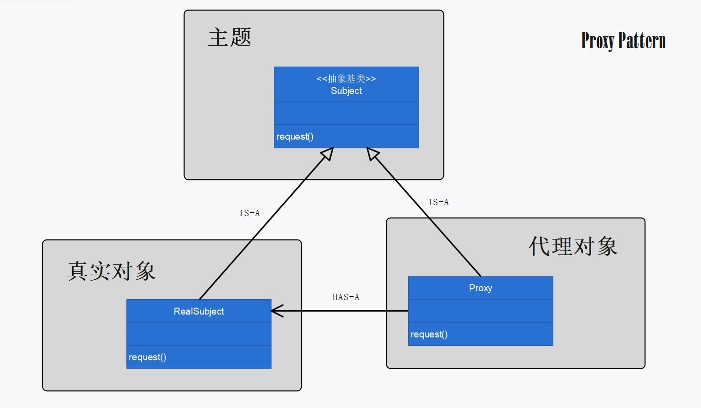

# 第十一章：代理模式

## 定义

为另一个对象提供一个替身或占位符以控制对这个对象的访问。

## 使用场景

当需要控制客户对对象的访问时，需要使用代理模式。

代理对象和真实对象实现了相同的主题接口：

```cpp
class Icon
{
public:
	virtual void getIconWidth() = 0;
	virtual void getIconHeight() = 0;
	virtual void paintIcon() = 0;
	virtual ~Icon();
};
```

客户调用代理对象的方法：

```cpp
Icon * image2 = new ImageProxy;
image2->getIconHeight();
image2->getIconWidth();
image2->paintIcon();
```

代理对象将客户的请求委托（转发）给真实对象。代理对象调用真实对象的方法处理客户的请求，并从中进行访问控制：

```cpp
ImageIcon * imageIcon;

void ImageProxy::getIconWidth()
{
	if (this->imageIcon != nullptr)
		this->imageIcon->getIconWidth();
	else
	{
		cout << "ImageProxy：默认宽度" << endl;
	}
}

void ImageProxy::getIconHeight()
{
	if (this->imageIcon != nullptr)
		this->imageIcon->getIconHeight();
	else
	{
		cout << "ImageProxy：默认高度" << endl;
	}
}

void ImageProxy::paintIcon()
{
	if (this->imageIcon != nullptr)
		this->imageIcon->paintIcon();
	else
	{
		cout << "ImageProxy：图像加载中..." << endl;
		if (!this->retrieving)
		{
			this->retrieving = true;
			thread retrievalThread(&ImageProxy::myRun, this, &this->imageIcon);
			retrievalThread.detach();
		}
	}
}
```

对客户而言，代理对象的存在是完全透明的。

访问控制的需求可能出于多种目的，即代理的根本目的是控制访问，但实际中的表现形式可能不同：

- 远程代理：管理客户和远程对象之间的交互。（远程对象指，在不同的地址空间运行的远程对象）
- 虚拟代理：控制访问实例化开销大的对象。
- 保护代理：根据访问权限决定客户可否访问对象。

## 代理模式的必要性和可行性

当真实对象是远程对象，或创建开销大的对象，或需要被保护的对象，或基于其他考虑时，需要使用代理模式。若不用代理模式：

1. 用户需要处理和远程对象交互的网络细节，这对客户而言是繁琐且不必要的。
2. 实例化一个创建开销大的对象会阻塞用户的进程。
3. 用户可能调用真实对象中超出自己权限范围的成员方法。

使用代理模式，可以避免上述弊端：

1. 用户可以像操作本地对象一样操作远程对象，而不用关心网络交互的细节；由代理对象实现底层的网络交互。
2. 代理对象基于多线程实例化真实对象，不会阻塞用户的进程；且在真实对象创建完成前， 代理对象可以做一些替代操作。
3. 代理对象基于用户的访问权限控制用户是否可以访问真实对象的某些方法，使用户无法僭越。

## 设计理念

1. 所谓的代理（proxy），就是代表某个真实的对象。使用代理模式创建代表（representative）对象，让代表对象控制某对象的访问，被代理的对象可以是远程的对象、创建开销大的对象或需要安全控制的对象。
2. 因为 `Proxy` 和 `RealSubject` 实现相同的接口 `Subject` ，所以任何用到 `RealSubject` 的地方，都可以用 `Proxy` 取代。
3. 代理模式有许多变体，这些变体都有共通点：代理对象都会将客户对主题（Subject）施加的方法调用拦截下来。

## 设计原则


## UML 图

p461



## 代码解释

1. 本例实现了虚拟代理，用 `Sleep()` 模拟创建开销大的对象。使用虚拟代理防止创建开销大的对象的实例化过程阻塞客户进程。

2. 装饰者模式、代理模式，二者形式相似，但是意图不同：装饰者为对象增加行为，而代理是控制对象的访问。

3. `std::thread` 多线程的使用：当线程函数是类成员函数时，须像这样 `&ImageProxy::myRun` 指定函数入口，且成员函数隐含着 `this` 参数。

4. 本例中，线程函数的参数需使用二级指针，以通过地址传递改变 `this->imageIcon` 的值。

5. 线程在被销毁前，必须调用过 `join()` 或 `detach()` 。

   > thread objects that are *joinable* shall either be *joined* or *detached* before they are *destroyed*.