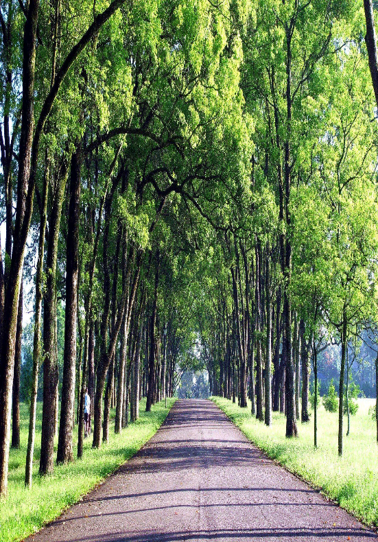
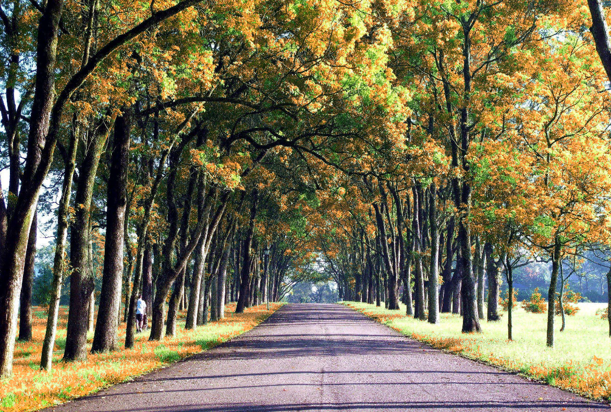
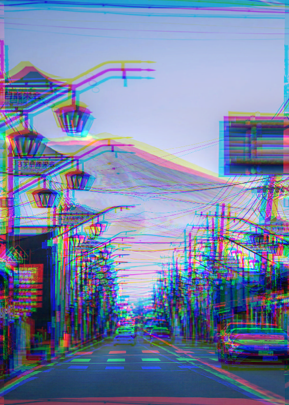
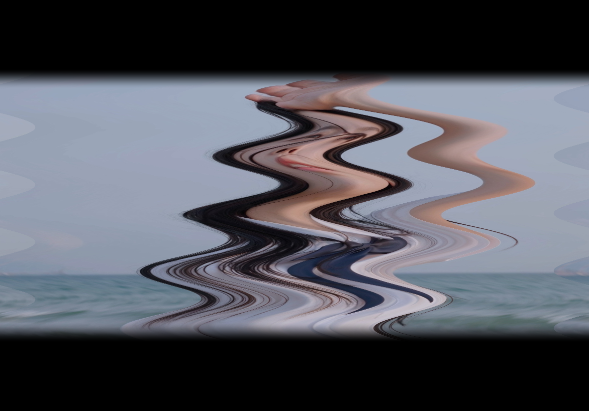
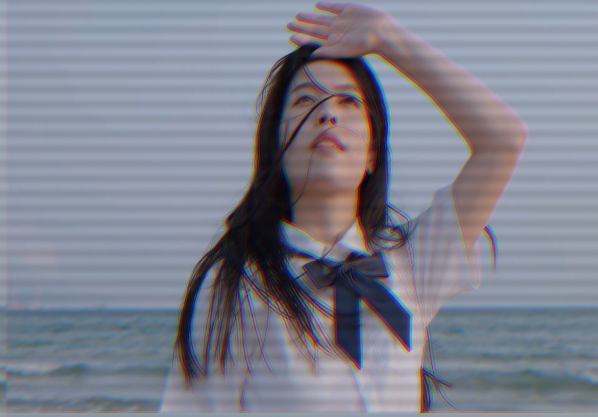

# Shadertoy
常用的特效 shader

## Gaussian Blur-高斯模糊

使用高斯核对图片各像素点做卷积。

### 用一次 pass 实现

用一次 pass 实现时，计算量较大，当卷积核尺寸为 25 x 25 时卡顿明显。

下图是用一次 pass 实现的高斯模糊效果。

> GaussianBlur_single_pass.frag

### 用两次 pass 实现

用一次 pass 实现时，计算量较小，当卷积核尺寸为 25 x 25 时依旧流畅，且与用一次pass实现时效果相似。

下图是用两次 pass 实现的高斯模糊效果。

> GaussianBlur_double_pass.frag

下图是第一次 pass 的中间输出，第一次 pass 只对水平方向模糊。

> GaussianBlur_pass_1.frag

## Change To Autumn-树叶变黄

第一次 pass 用来抠出原图中的绿色部分。第二次 pass 将绿色部分变黄后与原图混合。

### 原图

### 过程中_1

变化过程按圆形扩散。

> ChangeToAutumn_double_pass.frag

### 过程中_2

变化过程按纹理扩散。使用 smoothstep() 可以实现无显著边界的渐变。

> ChangeToAutumn_double_pass2.frag

### 滤镜后

> ChangeToAutumn_double_pass.frag

## RGB Split-RGB 分离

一次 pass 即可实现。

### 滤镜后

> RGBSplit_single_pass.frag

## Tv Open-电视开启

包含白色开场、纵向压缩、水平抖动三部分。

一次 pass 即可实现。

> TvOpen_single_pass.frag

### 白色开场

使用椭圆控制黑白混合比例。

### 纵向压缩

纹理压缩，使用 z 分量控制混合比例。

### 水平抖动

包括 RGB 颜色分离、黑色条纹、纹理偏移三部分。

