# 基础绘图-Draw Shape

包括基础几何图形的绘制及坐标计算。

绘制：椭圆、扇形、凸多边形、圆角矩形、线段。

计算：正五边形顶点、两直线交点、两向量夹角。

集合运算：两图形求交、两图形求并、两图形求差。

> DrawShape_single_pass.frag

# 滤镜特效

滤镜特效，单输入流

## Gaussian Blur-高斯模糊

使用高斯核对图片各像素点做卷积。

### 用一次 pass 实现

用一次 pass 实现时，计算量较大，当卷积核尺寸为 25 x 25 时卡顿明显。

下图是用一次 pass 实现的高斯模糊效果。

> GaussianBlur_single_pass.frag

### 用两次 pass 实现

用一次 pass 实现时，计算量较小，当卷积核尺寸为 25 x 25 时依旧流畅，且与用一次pass实现时效果相似。

下图是用两次 pass 实现的高斯模糊效果。

> GaussianBlur_double_pass.frag

下图是第一次 pass 的中间输出，第一次 pass 只对水平方向模糊。

> GaussianBlur_pass_1.frag

## Change To Autumn-树叶变黄

第一次 pass 用来抠出原图中的绿色部分。第二次 pass 将绿色部分变黄后与原图混合。

### 原图

### 过程中_1

变化过程按圆形扩散。

> ChangeToAutumn_double_pass.frag

### 过程中_2

变化过程按纹理扩散。使用 smoothstep() 可以实现无显著边界的渐变。

> ChangeToAutumn_double_pass2.frag

### 滤镜后

> ChangeToAutumn_double_pass.frag

## RGB Split-RGB 分离

一次 pass 即可实现。

### 滤镜后

> RGBSplit_single_pass.frag

## Tv Open-电视开启

包含白色开场、纵向压缩、水平抖动三部分。

一次 pass 即可实现。

> TvOpen_single_pass.frag

### 白色开场

使用椭圆控制黑白混合比例。

### 纵向压缩

纹理压缩，使用 z 分量控制混合比例。

### 水平抖动

包括 RGB 颜色分离、黑色条纹、纹理偏移三部分。

## FXAA

基于视觉的抗锯齿。

### 原图

### FXAA-Quality 反走样

> FXAA-Quality_single_pass.frag

### FXAA-Console 反走样

> FXAA-Console_single_pass.frag

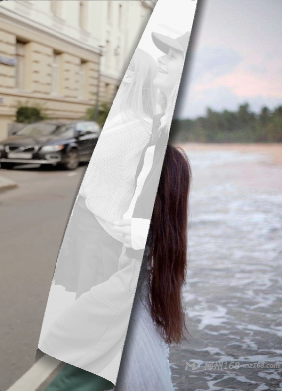

## LUT Filter-色彩滤镜

通过 LUT 查表得到颜色映射值。

> OrientationBlur_single_pass.frag

### 原图

* 原始色彩图

  

* 原始 LUT 图

  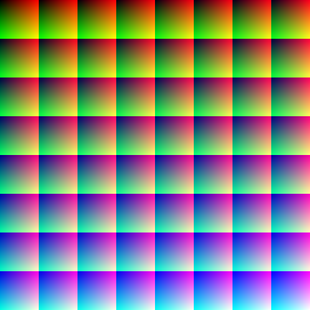

### 滤镜后

* 滤镜后色彩图

  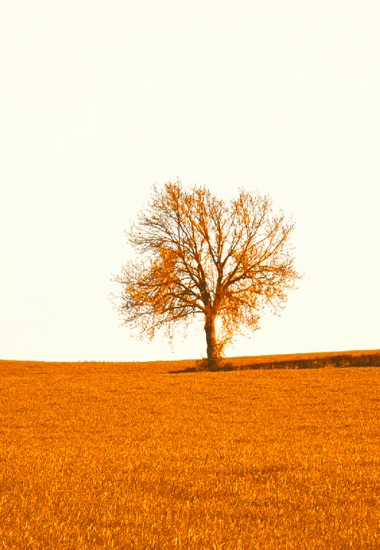

* 滤镜后 LUT 图

  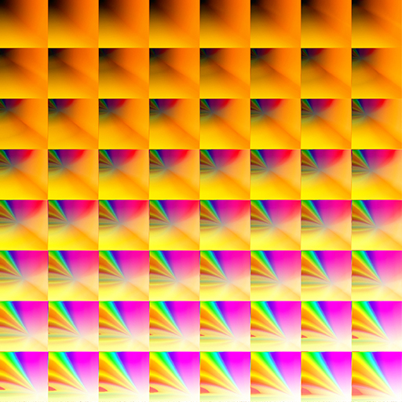

## Orientation Blur-方向模糊

在指定方向上加权平均。

> OrientationBlur_single_pass.frag

### 定向模糊

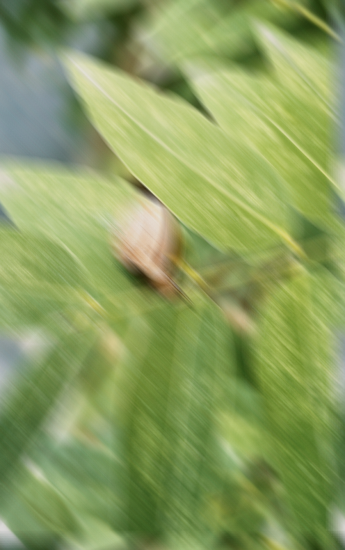

### 径向模糊

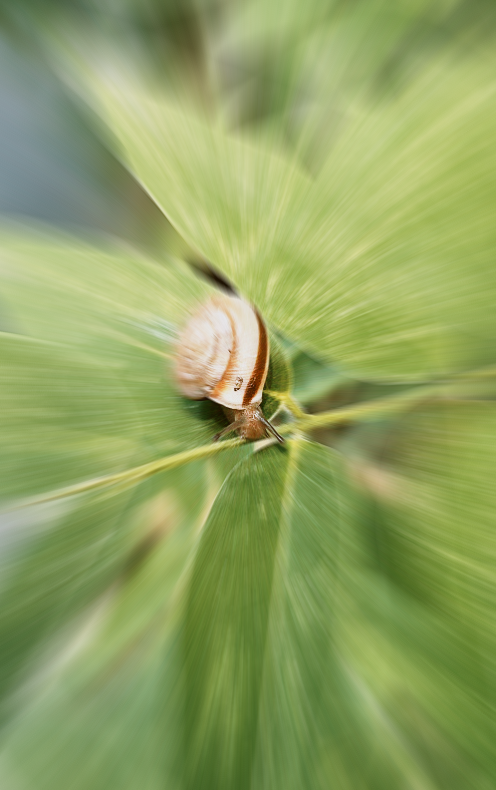

## Unsharpen Mask-USM 锐化

通过在原图上叠加高频分量实现锐化。radius 控制低通滤波核半径，amount 控制叠加的高频分量程度，threshold 为是否锐化阈值。

> UnsharpenMask_single_pass.frag

### 原图

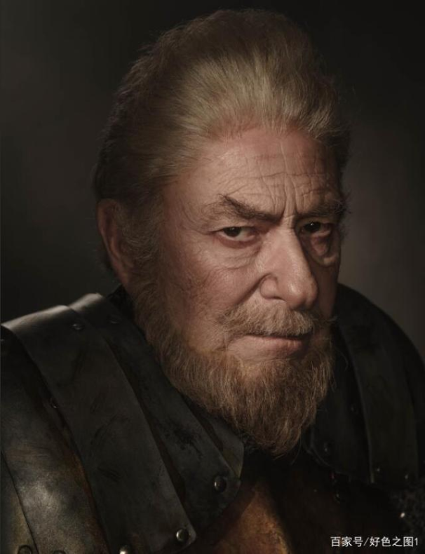

### 锐化后

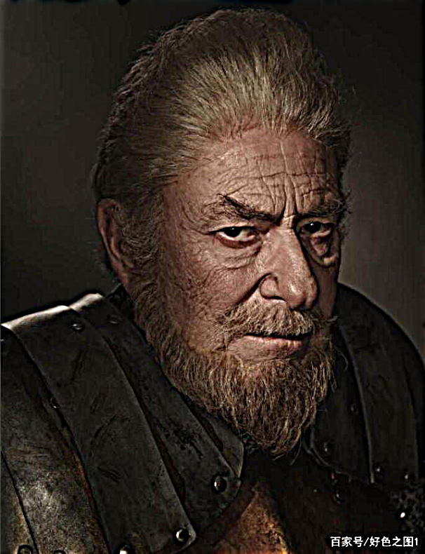

## Particle Fuzzy-粒子模糊

随机在周围采样贴纹理颜色。

> ParticleFuzzy_single_pass.frag

### 滤镜后

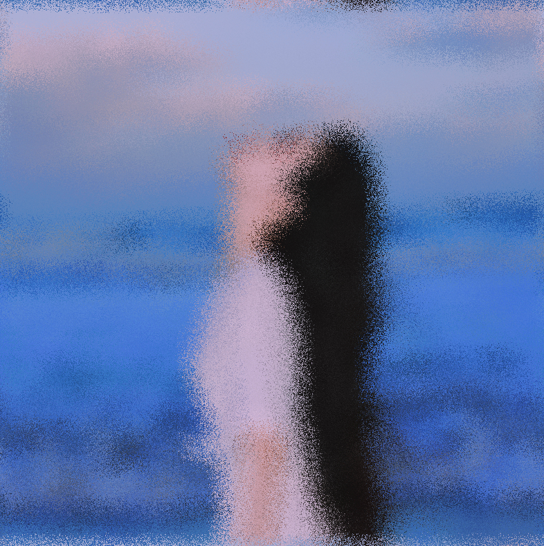

# 转场特效

转场特效，双输入流

## Page Flip-翻页

包含纹理贴图、添加阴影、抗锯齿三部分。

### 纹理贴图

将当前页右下角与圆柱面固接，通过圆柱向左侧滚动实现翻页效果。通过计算当前点坐标按弧面展开坐标判断当前点是否处于书背 or 当前页扭曲处。圆柱运动方向与圆柱轴线方向垂直，可调参数有两个：圆柱运动方向、圆柱半径。

> PageFlip_pass_1.frag

### 添加阴影

分别在书背左方、下方、右方添加了三处阴影，通过将当前颜色与黑色混合实现。

### 抗锯齿

对书背左方、右方处进行了抗锯齿处理，通过第二次 pass 的高斯模糊实现。

> PageFlip_double_pass.frag

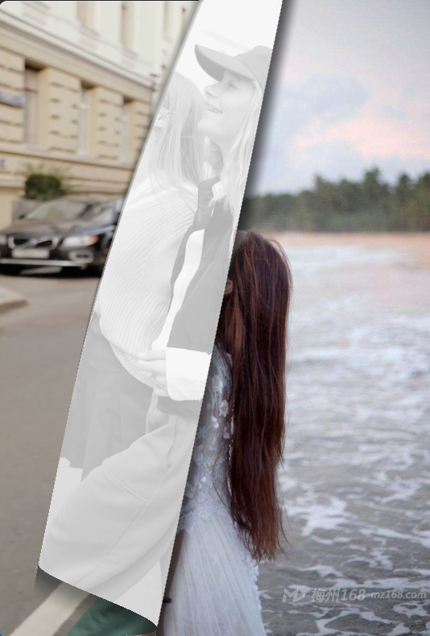

## Magnify-放大

> Magnify_single_pass.frag

### 过程中

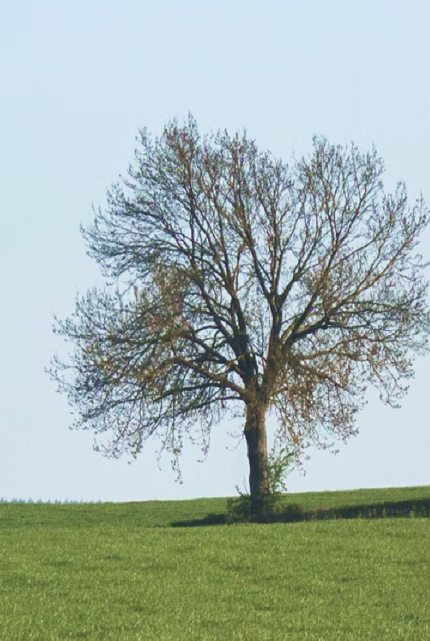

## Shutter-快门

包括正五边形的绘制、线段绘制两部分。

> Shutter_single_pass.frag

### 过程中

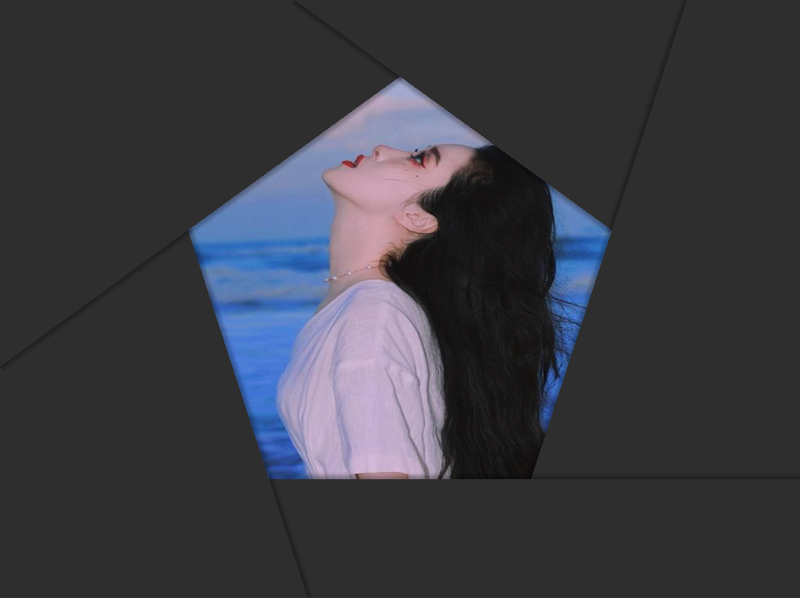
