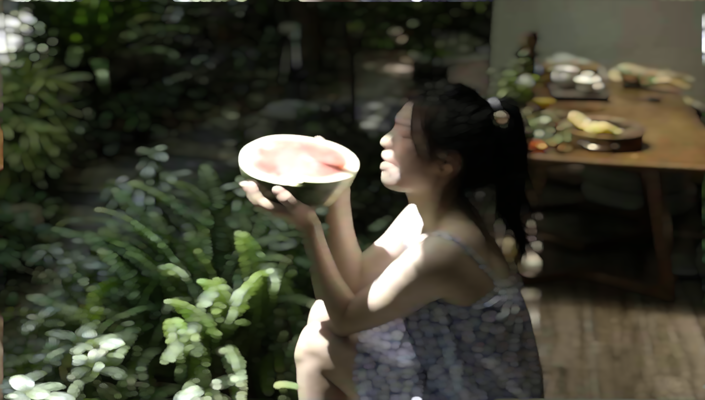

# 基础绘图-DrawShape

包括基础几何图形的绘制及坐标计算。

绘制：椭圆、扇形、凸多边形、圆角矩形、线段。

计算：正五边形顶点、两直线交点、两向量夹角。

集合运算：两图形求交、两图形求并、两图形求差。

> DrawShape_single_pass.frag

# 滤镜特效

滤镜特效，单输入流

## FT_Base-基础滤镜

通过将原图颜色直接缩放实现亮度滤镜，通过原图与亮度图的混合实现饱和度滤镜，通过原图与纯灰色的混合实现对比度滤镜。

> Base_single_pass.frag

### 滤镜后

## FT_StrengthDisplay-颜色分级显示

模拟显示系统只能显示较少强度等级时的效果。人类对光强度的感觉按对数等级变化，这意味着若两个强度的比率与另外两个强度之间的比率相同，则我们所感觉到的两个强度之间的差异也相同。即，强度等级不应该按等差数列划分，而应该按等比数列划分。

### 滤镜后-灰度图

> FT_StrengthDisplay_single_pass.frag

### 滤镜后-彩色图

> FT_StrengthDisplay_single_pass_channels.frag

## FT_GaussianBlur-高斯模糊

使用高斯核对图片各像素点做卷积。

### 用一次 pass 实现

用一次 pass 实现时，计算量较大，当卷积核尺寸为 25 x 25 时卡顿明显。

下图是用一次 pass 实现的高斯模糊效果。

> GaussianBlur_single_pass.frag

### 用两次 pass 实现

用一次 pass 实现时，计算量较小，当卷积核尺寸为 25 x 25 时依旧流畅，且与用一次pass实现时效果相似。

下图是用两次 pass 实现的高斯模糊效果。

> GaussianBlur_double_pass.frag

下图是第一次 pass 的中间输出，第一次 pass 只对水平方向模糊。

> GaussianBlur_pass_1.frag

## FT_BilateralFilter-双边滤波

使用双边滤波实现磨皮效果。双边滤波与高斯模糊的区别在于高斯模糊的权重域只有空间域（spatial domain S），而双边滤波的权重域还包括像素范围域（即像素值的欧氏距离，range domain R）。权重域中加入像素范围域使得原图中颜色变化大的部分权重较低，从而更多地保留了边界信息。
>BilateralFilter_single_pass.frag

### 滤镜后

## FT_SurfaceBlur-表面模糊

表面模糊与高斯模糊的区别在于使用的权重不同，高斯模糊根据空间域的距离计算权重，表面模糊根据像素域颜色的曼哈顿距离计算权重。

>SurfaceBlur_single_pass.frag

### 滤镜后

## FT_BilateralTextureFilter-双边纹理滤波

与传统双边滤波不同的是，双边纹理滤波计算权重时使用指导图像 T，而不是原始图像 I，因为指导图像 T 更多地反映了纹理信息。

指导图像 T 的计算：对原图 I 中的每个像素点 p，计算其 k✖️k 邻域范围内平均值得到 B_p；对每个像素点 p，有 k✖️k 个候选块，选择这 k✖️k 个候选块中灰度差值最小的的那个候选块作为像素 p 的指导图像块 q。则指导图像在像素 p 的值 T_p = B_q。

> BilateralTextureFilter_quartic_pass.frag

### 滤镜后

## FT_OrientationBlur-方向模糊

在指定方向上加权平均。

> OrientationBlur_single_pass.frag

### 定向模糊

### 径向模糊

## FT_CircumBlur-圆周模糊

在同心圆上多次采样取平均。注意图像边缘的处理。
>CircumBlur_single_pass.frag

### 滤镜后

## FT_BokehBlur-散景模糊

通过在圆形散景上采样实现散景模糊。值得注意的是各采样颜色的加权方式，在 BokehBlur 中使用的（以采样值累和作为分母的）加权方式在效果上略优于其他模糊方法中使用的（以采样次数作为分母的）加权方式。

> BokehBlur_single_pass.frag

CoC 值反映了散景程度，当 CoC 增大时，应适当增加采样次数，以避免明显的采样伪迹。

### CoC = 0.4  sampleCnt = 100

### CoC = 0.8  sampleCnt = 100

### CoC = 1.6  sampleCnt = 100

### CoC = 1.6  sampleCnt = 500

## DepthOfField-景深

使用 BokehBlur 模拟景深效果，将深度图作为 mask，一定深度范围内的物体不进行景深处理。注意，深度图 mask 的阶跃性造成了人像边界处的模糊。

### 用一次 pass 实现

> DepthOfField_single_pass.frag

### 用两次 pass 实现

第一次 pass 使用高斯模糊对深度图做模糊处理，以降低深度图 mask 的阶跃性。第二次 pass 将模糊后的深度度作为 mask，使用 BokehBlur 模拟景深效果。

使用经过模糊后的深度图在效果上优于使用原始深度图，这体现在当人像边界处模糊程度一致时（人像边界处的模糊是深度图跃性造成的），前后景可以模拟出更明显的景深效果。

> DepthOfField_double_pass.frag

## FT_TiltShift-移轴摄影

前景使用原图，背景进行散景模糊。

> TiltShift_double_pass.frag

### 圆形

### 水平

## FT_ParticleBlur-粒子模糊

随机在周围采样贴纹理颜色。

> ParticleBlur_single_pass.frag

### 滤镜后

## FT_BackgroundBlur-背景模糊

前两次 pass 用来对原图进行模糊处理，以得到最终的背景图。由于需要颜色比较单一的背景图，因而模糊阶段需要较大的卷积核。若模糊阶段的步长过大，则会在模糊的背景中引入纹理噪声。

注意前两次 pass 时卷积核权重的计算方式：

1. 先根据纹理宽高比及画布宽高比将原图边缘向中心镜像，从而忽略原图中心区域的颜色；

2. 卷积位置距离画布边缘越近，权重越大。

注意第三次 pass 时前景纹理坐标的计算方式：

1. 使用 textureResolution 及 fragCoord 保持纹理宽高比；
2. 根据纹理宽高比及画布宽高比调整纹理尺寸，使纹理充分填充画布。

> BackgroundBlur_triple_pass.frag

### 纹理尺寸调整前

### 纹理尺寸调整后

## FT_ChangeToAutumn-一键变秋天

第一次 pass 用来抠出原图中的绿色部分。第二次 pass 将绿色部分变黄后与原图混合。

### 原图

### 过程中_1

变化过程按圆形扩散。

> ChangeToAutumn_double_pass.frag

### 过程中_2

变化过程按纹理扩散。使用 smoothstep() 可以实现无显著边界的渐变。

> ChangeToAutumn_double_pass2.frag

### 滤镜后

> ChangeToAutumn_double_pass.frag

## FT_RGBSplit-RGB 分离

一次 pass 即可实现。

### 滤镜后

> RGBSplit_single_pass.frag

## FT_OutlineOff-轮廓错位

基于亮度的边缘检测。

> OutlineOff_single_pass.frag

### 定向错位

### 径向错位

## FT_RGBSplitOutlineOff-轮廓错位 RGB 分离

在轮廓错位的基础上进行 RGB 分离。RGB 三个通道需分别进行边缘检测。

> RGBSplitOutlineOff_single_pass.frag

### 定向分离

### 径向分离

## FT_RollingShow-分屏滚动

简单的坐标变换。

> RollingShow_single_pass.frag

### 垂直滚动

### 水平滚动

## RollingShowOrientation-定向分屏滚动

若想将斜线角度、贴图宽高比与显示分辨率解耦，则不能使用基于显示分辨率的纹理坐标 uv，而应该直接使用当前点坐标 fragCoord 进行坐标变换。

> RollingShowOrientation_single_pass.frag

### 滤镜后

## FT_TvOpen-电视开启

包含白色开场、纵向压缩、水平抖动三部分。

一次 pass 即可实现。

> TvOpen_single_pass.frag

### 白色开场

使用椭圆控制黑白混合比例。

### 纵向压缩

纹理压缩，使用 z 分量控制混合比例。

### 水平抖动

包括 RGB 颜色分离、黑色条纹、纹理偏移三部分。

## FT_FXAA-FXAA 反走样

基于视觉的抗锯齿。

### 原图

### FXAA-Quality 反走样

> FXAA-Quality_single_pass.frag

### FXAA-Console 反走样

> FXAA-Console_single_pass.frag

## FT_LUTFilter-色彩滤镜

通过 LUT 查表得到颜色映射值。shader 后缀是 lut 表尺寸。

> LUTFilter_single_pass_512_512.frag

### 原图

* 原始色彩图

  

* 原始 LUT 图

  

### 滤镜后

* 滤镜后色彩图

  

* 滤镜后 LUT 图

  

## FT_UnsharpenMask-USM 锐化

通过在原图上叠加高频分量实现锐化。radius 控制低通滤波核半径，amount 控制叠加的高频分量程度，threshold 为是否锐化阈值。

> UnsharpenMask_single_pass.frag

### 原图

### 锐化后

## FT_Voronoi-泰森多边形
基于 Voronoi 剖分为像素点贴上不同的纹理。
>Voronoi_single_pass.frag

### 过程中

### 滤镜后

## FT_Cullet-碎玻璃

基于泰森多边形。每个玻璃块相应缩小，以让出边界；并在边界处填充背景色。

> Cullet_single_pass

### 滤镜后

## FT_Mosaic-马赛克

使一定范围内的像素点显示相同的颜色。
>Mosaic_single_pass.frag

### 滤镜后

## FT_Halftone-半色调

在马赛克效果的基础上计算变换后的纹理坐标与原始纹理坐标的偏移量，根据偏移量决定二值化的阈值。受当前像素灰度值影响的二值化阈值使得二值化图像越接近黑色的部分墨迹点越大。

不同的马赛克块尺寸与墨迹点尺寸的组合可以呈现出不同的滤镜效果。

### 滤镜后-灰度图

>Halftone_single_pass.frag

* tileSize = 2  dotSize = 1.5

* tileSize = 3  dotSize = 4

* tileSize = 8  dotSize = 6

### 滤镜后-彩色图

> Halftone_single_pass_channels.frag

* tileSize = 10  dotSize = 10

## FT_LocalExplosion-局部爆炸

注意圆环的绘制方式，水平方向的缩放将圆环形状与视口宽高比解耦。

> LocalExplosion_single_pass.frag

### 滤镜后

## FT_RoundSwell-圆形鼓包

将当前点纹理坐标沿球面展开。可调参数包括球心坐标、半径。

> RoundSwell_single_pass.frag

### 滤镜后

## GlassBlock-玻璃块

三次贝塞尔的应用。若想将斜线角度与显示分辨率解耦，则不能使用基于显示分辨率的纹理坐标 uv，而应该直接使用当前点坐标 fragCoord 计算斜线坐标。

> GlassBlock_single_pass.frag

### 滤镜后

## FT_ElectronicRollingShutter-电子卷帘快门

ElectronicRollingShutter 是逐行 reset 的，因此根据 y 轴坐标在 x 轴方向做偏移以模拟相机横向移动时电子卷帘快门的拍摄效果。

> ElectronicRollingShutter_single_pass.frag

### 滤镜后

## FT_SoulOut-灵魂出窍

通过放大+透明度变化实现灵魂出窍效果。

> SoulOut_single_pass.frag

### 滤镜后

## FT_BumpMapping-凹凸映射

基于像素点的颜色估计像素点的法向量，通过 Blinn-Phone 光照模型使图像具有立体感。

通过颜色估计像素点高度。在任一点处，构造以该点为形心的正三角形，通过三角形的两条边计算该三角形的法向量作为该点的法向量。基于 Blinn-Phone 模型计算像素颜色。

> BumpMapping_single_pass.frag

### 滤镜后

# 转场特效

转场特效，双输入流

## TR_PageFlip-翻页

包含纹理贴图、添加阴影、抗锯齿三部分。

### 纹理贴图

将当前页右下角与圆柱面固接，通过圆柱向左侧滚动实现翻页效果。通过计算当前点坐标按弧面展开坐标判断当前点是否处于书背 or 当前页扭曲处。圆柱运动方向与圆柱轴线方向垂直，可调参数有两个：圆柱运动方向、圆柱半径。

> PageFlip_pass_1.frag

### 添加阴影

分别在书背左方、下方、右方添加了三处阴影，通过将当前颜色与黑色混合实现。

### 抗锯齿

对书背左方、右方处进行了抗锯齿处理，通过第二次 pass 的高斯模糊实现。

> PageFlip_double_pass.frag

## TR_Magnify-放大

> Magnify_single_pass.frag

### 过程中

## TR_Shutter-快门

包括正五边形的绘制、线段绘制两部分。

> Shutter_single_pass.frag

### 过程中

## TR_SlipOff-滑出

包括阴影的添加。

> SlipOff_single_pass.frag

### 过程中

## TR_SlipInto-滑入

在 Slip Out 的基础上使用缓动曲线控制下一页位置。

> SlipInto_single_pass.frag

### 过程中

## TR_Spin-自旋

通过矩形面旋转实现自旋效果。

> Spin_single_pass.frag

### 过程中

## TR_Split-切分

通过计算变换后的纹理坐标实现切分效果。注意镜像纹理包裹模式的实现。

> Split_single_pass.frag

### 过程中_1

### 过程中_2

## RouletteInto-轮盘进入

以视口下边界中心为轴旋转进入+圆周模糊。

> RouletteInto_single_pass.frag

### 过程中

## TR_StretchOff-拉出

简单的坐标变换。

> StretchOff_single_pass.frag

### 过程中_1

### 过程中_2

