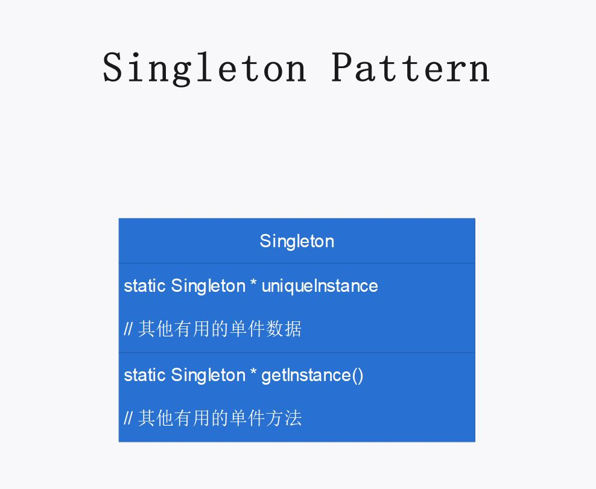

# 第五章：单件模式

## 定义

确保一个类只有一个实例，并提供全局访问点。

## 使用场景

1. 当子类的方法具有极大的共性，完全没有个性时，可使用公有继承的普通方法：

   ```cpp
   void swim();
   ```

2. 当子类的方法共性很少，具有极大的个性时，可使用公有继承的虚方法：

   ```cpp
   virtual void display();
   ```

3. 当子类的方法具有一部分共性，同时具有比较多的个性，且需要经常变化时，可使用策略模式：

   使用组合（has-a）替代公有继承（is-a），作为客户，向提供商提出算法需求，由提供商实现算法。

   ```cpp
   FlyBehavior* flyBehavior;
   
   void performFly()
   {
   this->flyBehavior->fly();
   }
   
   void setFlyBehavior(FlyBehavior* fb)
   {
   this->flyBehavior = fb;
   }
   
   ```

## 单件模式的必要性和可行性

在策略模式解决的问题（子类的方法具有一部分共性，同时具有比较多的个性，且需要经常变化）中，若使用一般的公有继承虚方法，则代码复用很差，且不易维护：

1. 因为子类方法具有一部分共性，则每个子类均需在公有继承的虚方法中自己写一份独有但是完全相同的代码，因此代码复用差。
2. 一旦需要更改多个相同的子类方法时，需要每个子类独立完成更改，即使这些更改是完全相同的，因此不易维护。

若使用策略模式，可以避免上述这两个问题：

1. 由算法提供商写算法的实现，每个子类根据需求选择算法，因此每个算法只有一份实现，代码复用更好。

2. 当需要更改多个相同的子类方法时，只需更改算法提供商的算法实现即可，因此易于维护。

3. 除此之外，使用策略模式使得子类可以动态地改变算法，因而子类是针对接口编程，而不是针对实现编程的。

## 设计理念

1. 用组合（has-a）替代公有继承（is-a）。

2. 将算法封装到算法族中，客户类在算法族中选择需使用的算法，算法类作为算法的提供商。

## 设计原则

## UML 图

p177



## 代码解释

1. `display()` 为一般的虚函数，因为每个鸭子子类的展示方式不同；
2. `FlyBehavior` 和 `QuackBehavior` 是提供商虚基类，`MuteQuack` 等是提供商（算法）；
3. `Duck` 是用户基类；

`RedheadDuck` 是用户。

c++ 11  [*Magic Statics*](http://herbsutter.com/2013/09/09/visual-studio-2013-rc-is-now-available/).

> If control enters the declaration concurrently while the variable is being initialized, the concurrent execution shall wait for completion of the initialization.
> 如果当变量在初始化的时候，并发同时进入声明语句，并发线程将会阻塞等待初始化结束。

函数内静态变量的声明周期为

static 函数变量的生命周期从第一次遇到声明开始，并在程序结束时结束。

https://www.cnblogs.com/sunchaothu/p/10389842.html


1. 通过局部静态变量的特性保证了线程安全 (C++11, GCC > 4.3, VS2015支持该特性);
2. 注意在使用的时候需要声明单例的引用 `Single&` 才能获取对象。
3. 为什么使用引用而不是指针：
   1. 指针和引用在语法上的最大区别就是指针可以为NULL，并可以通过delete运算符删除指针所指的实例，而引用则不可以。由该语法区别引申出的语义区别之一就是这些实例的生存期意义：通过引用所返回的实例，生存期由非用户代码管理，而通过指针返回的实例，其可能在某个时间点没有被创建，或是可以被删除的。但是这两条Singleton都不满足，因此在这里，我使用指针，而不是引用。
4. 全局变量和单件模式的区别：
   1. 其拥有全局变量的众多特点：全局可见且贯穿应用程序的整个生命周期。除此之外，单件模式还拥有一些全局变量所不具有的性质：同一类型的对象实例只能有一个，同时适当的实现还拥有延迟初始化（Lazy）的功能，可以避免耗时的全局变量初始化所导致的启动速度不佳等问题。要说明的是，Singleton的最主要目的并不是作为一个全局变量使用，而是保证类型实例有且仅有一个。它所具有的全局访问特性仅仅是它的一个副作用。但正是这个副作用使它更类似于包装好的全局变量，从而允许各部分代码对其直接进行操作。

必须禁止拷贝构造，否则如下调用会产生两个对象：

```cpp
ChocolateBoiler d = ChocolateBoiler::getInstance();
```

若将拷贝构造禁止，则上述代码无法通过编译。