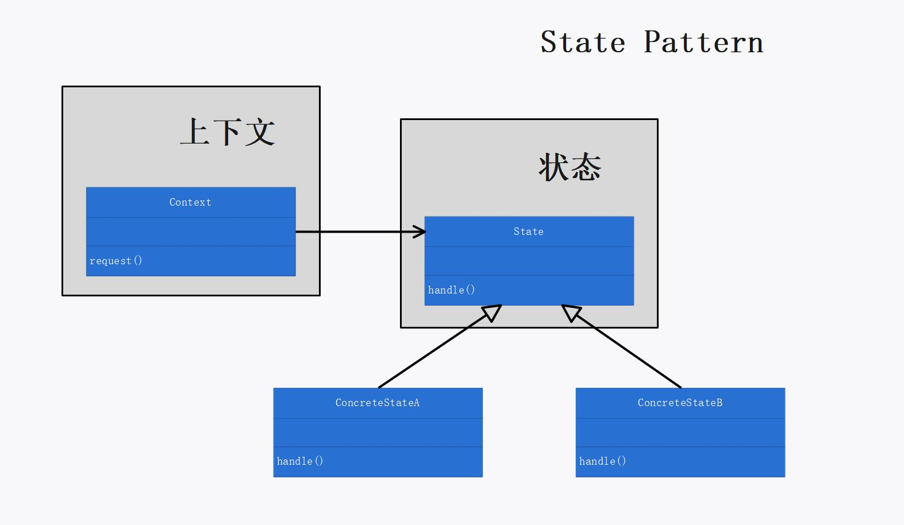

# 第十章：状态模式

## 定义

允许对象在内部状态改变时改变它的行为，对象看起来好像修改了它的类。

## 使用场景

当 `Context` 需要在多个状态中切换，并根据不同的状态表现出不同的行为时，可以使用状态模式。

`Context` 可以（通过组合）持有多个状态对象，但只能”激活“一个状态对象为当前状态：

```cpp
class GumballMachine
{
private:
	static shared_ptr<State>soldOutState;
	static shared_ptr<State>noQuarterState;
	static shared_ptr<State>hasQuarterState;
	static shared_ptr<State>soldState;
	static shared_ptr<State>winnerState;

	shared_ptr<State> curState;
};
```

`Context` 将动作委托给当前状态对象（去执行）：

```cpp
void GumballMachine::insertQuater()
{
	this->curState->insertQuarter(this);
}

void GumballMachine::ejectQuarter()
{
	this->curState->ejectQuarter(this);
}

void GumballMachine::turnCrank()
{
	if (this->curState->turnCrank(this))
		this->curState->dispense(this);
}
```

`Context` 的当前状态的切换可以是 `Context` 自己决定的，也可以是当前状态对象决定的：

```cpp
//由当前状态对象决定 Context 状态的切换
void HasQuarterState::ejectQuarter(GumballMachine * gumballMachine)
{
	cout << gumballMachine << "退回25分钱" << endl;
	gumballMachine->setCurState(gumballMachine->getNoQuarterState());
}

//由 Context 本身决定其状态的切换
void GumballMachine::refill(int count)
{
	cout << this << "装填糖果" << endl;
	this->count = count;
	this->curState = this->noQuarterState;
}
```

## 状态模式的必要性和可行性

`Context` 的功能需求可能变化，潜在的状态也可能变化。若不使用状态模式（即，在动作方法内通过条件判断语句处理不同的状态），则：

1. 当 `Context` 需要增加新的状态时，每个动作方法都需要修改。因为必须要在每个动作方法中加入一个新的条件判断来处理新状态。
2. 没能封装变化（潜在状态的改变），针对某个状态的改变可能对代码的其他部分造成影响，不易于维护。
3. `Context` 的状态转换被埋藏在条件语句中，所以并不明显。

使用状态模式可以避免上述两个弊端：

1. 当 `Context` 需要增加新的状态时，动作方法无需做任何修改，因为 `Context` 的动作委托给了状态对象，只需令新增的状态实现相应的动作即可。
2. 局部化每个状态的行为，将 `Context` 的动作委托给状态对象。针对某个状态的改变不会对其他状态（代码的其他部分）造成影响，遵守了”封装变化“原则，易于维护。
3. 状态模式把一个状态的所有行为放在一个类中，将行为局部化的同时，使得 `Context` 状态的改变显而易见。


## 设计理念

1.  通过将状态封装成为独立的类，可以将以后需要做的改变局部化。
2. `Context` 持有一组状态对象（多个 `Context` 可共享同一组状态对象）并”激活“某一个状态作为当前状态对象，将动作委托给当前状态对象执行。
3. 使用组合，`Context` 通过简单引用不同的状态对象来造成类改变的假象。通过将行为包装进状态对象中，客户可以通过在 `Context` 内简单地改变状态对象来改变 `Context` 的行为。
4. `Context` 的当前状态在状态对象集合中游走改变，但是 `Context` 的客户对于状态对象了解不多，甚至根本是浑然不觉。

## 设计原则


## UML 图

p410



## 代码解释

1. 本例中，`GumballMachine` 类是 `Context` 。
2. 在 `GumballMachine` 实现中，通过使用 `Context` 上的 `getter` 方法把依赖减到最小，而不是显示硬编码具体状态类。
3. 固定的状态转换适合放于 `Context` 中，如本例的 `refill(int count)` 方法；动态的状态转换适合放于状态类中，如本例中根据运行时糖果数量决定状态要转换到 `NoQuarterState` 还是 `SoldOutState` 。
4. `Context` 可以有很多实例，这些实例可以共享状态对象，唯一的前提是，状态对象不能持有它们自己的内部状态。
   * 共享状态对象需要使用类内静态成员变量；
   * 如果状态需要利用到 `Context` 中的方法或者实例变量，则必须在状态对象的 `handle()` 方法内传入一个 `Context` 的引用（或指针），以指明是哪个 `Context` 在使用这个状态对象。
5. 注意类内静态成员变量的生命周期，本例使用智能指针防止内存泄漏。
6. `turnCrank()` 方法返回 `true` 的本质是：状态对象可以将 `Context` 的当前状态转换到一个可以正确执行 `dispense()` 方法的状态。
7. 策略模式、状态模式，二者类图相同，但是：
   1. 意图不同：
      * 状态模式将一群行为封装在状态对象中，`Context` 的行为随时可委托到那些状态对象中的一个；当前状态在状态对象集合中游走改变，以反映出 `Context` 内部的状态，从而使 `Context` 的行为也随之改变。
      * 策略模式中，客户通常主动指定 `Context` 所要组合的策略对象是哪一个；对于某个 `Context` 对象而言，通常只有一个最适当的策略对象。
   2. 用法（使用场景）不同：
      * 把策略模式想成是除了继承之外的一种弹性替代方案。使用策略模式，客户可以通过组合不同的对象来改变行为。
      * 把状态模式想成是不用在 `Context` 中放置许多条件判断的替代方案。使用状态模式，客户可以通过在 `Context` 内简单地改变（切换）状态对象来改变 `Context` 的行为。

