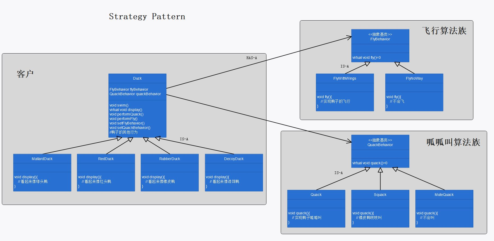

# 第一章：策略模式

## 定义

定义了算法族，分别封装起来，让它们之间可以互相替换，此模式让算法的变化独立于使用算法的客户。

## 使用场景

1. 当子类的方法具有极大的共性，完全没有个性时，可使用公有继承的普通方法：

   ```cpp
   void swim();
   ```

2. 当子类的方法共性很少，具有极大的个性时，可使用公有继承的虚方法：

   ```cpp
   virtual void display();
   ```

3. 当子类的方法具有一部分共性，同时具有比较多的个性，且需要经常变化时，可使用策略模式：

   使用组合（has-a）替代公有继承（is-a），作为客户，向提供商提出算法需求，由提供商实现算法。

   ```cpp
   FlyBehavior* flyBehavior;
   
   void performFly()
   {
   this->flyBehavior->fly();
   }
   
   void setFlyBehavior(FlyBehavior* fb)
   {
   this->flyBehavior = fb;
   }
   
   ```

## 策略模式的必要性和可行性

在策略模式解决的问题（子类的方法具有一部分共性，同时具有比较多的个性，且需要经常变化）中，若使用一般的公有继承虚方法，则代码复用很差，且不易维护：

1. 因为子类方法具有一部分共性，则每个子类均需在公有继承的虚方法中自己写一份独有但是完全相同的代码，因此代码复用差。
2. 一旦需要更改多个相同的子类方法时，需要每个子类独立完成更改，即使这些更改是完全相同的，因此不易维护。

若使用策略模式，可以避免上述这两个问题：

1. 由算法提供商写算法的实现，每个子类根据需求选择算法，因此每个算法只有一份实现，代码复用更好。

2. 当需要更改多个相同的子类方法时，只需更改算法提供商的算法实现即可，因此易于维护。

3. 除此之外，使用策略模式使得子类可以动态地改变算法，因而子类是针对接口编程，而不是针对实现编程的。

## 设计理念

1. 用组合（has-a）替代公有继承（is-a）。

2. 封装可互换的行为，并使用委托决定使用哪一个：将算法封装到算法族中，客户类在算法族中选择需使用的算法，算法类作为算法的提供商。

## 设计原则

1. 找出应用中可能需要变化之处，把他们独立出来，不要和那些不需要变化的代码混在一起。

2. 针对接口编程，而不是针对实现编程。

3. 多用组合（has-a），少用继承（is-a）。

## UML 图

p22



## 代码解释

1. `display()` 为一般的虚函数，因为每个鸭子子类的展示方式不同；

2. `FlyBehavior` 和 `QuackBehavior` 是提供商虚基类，`MuteQuack` 等是提供商（算法）；

3. `Duck` 是用户基类；

4. `RedheadDuck` 是用户。