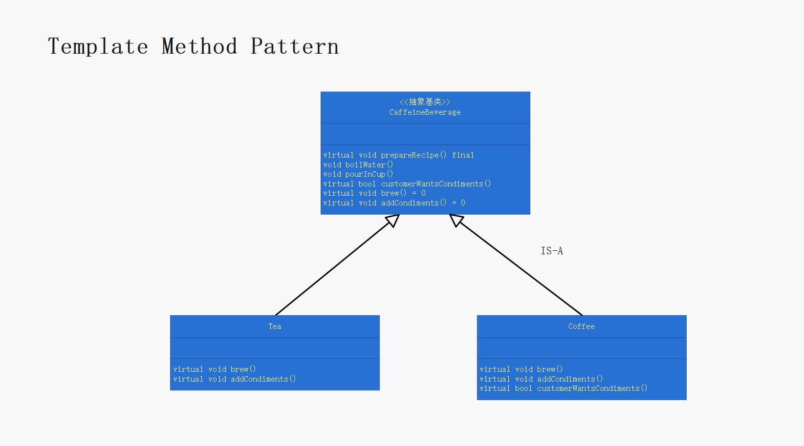

# 第八章：模板方法模式

## 定义

在一个方法中定义一个算法的骨架，而将一些步骤延迟到子类中。模板方法使得子类可以在不改变算法结构的情况下，重新定义算法中的某些步骤。

## 使用场景

若多个子类在某算法的实现上有很多相似的地方，但又各有不同。此时可使用模板方法模式将算法中共同的部分抽取出来，放进一个基类中，作为算法的框架：

```cpp
void CaffeineBeverage::prepareRecipe()
{
	this->boilWater();
	this->brew();
	this->pourInCup();
	if (this->customerWantsCondiments())
		this->addCondiments();
}
```

基类中的可以包含三种方法：

1. 具体方法：各子类中通用的方法，由基类提供实现：

    ```cpp
    void boilWater();
    void pourInCup();

    void CaffeineBeverage::boilWater()
    {
        cout << "把水煮沸" << endl;
    }

    void CaffeineBeverage::pourInCup()
    {
        cout << "倒入杯中" << endl;
    }
    ```

2. 抽象方法：子类独有的方法，由子类提供实现：

    ```cpp
    virtual void brew() = 0;
    virtual void addCondiments() = 0;
    
    void Coffee::brew()
    {
    	cout << "用沸水冲泡咖啡" << endl;
    }
    
    void Coffee::addCondiments()
    {
    	cout << "加糖和牛奶" << endl;
    }
    ```

3. 钩子：子类可选择的方法，由基类提供默认实现：

    ```cpp
    virtual bool customerWantsCondiments();
    
    bool CaffeineBeverage::customerWantsCondiments()
    {
    	return true;
    }
    
    bool Coffee::customerWantsCondiments()
    {
    	return false;
    }
    ```

模板方法模式（在基类中）将算法定义为一组步骤，其中的任何步骤都可以是抽象的，由子类负责实现。这可以确保算法的结构保持不变，同时由子类提供部分实现。

## 模板方法模式的必要性和可行性

子类在实现算法时有很多相似的代码，可以用模板方法模式将共同的部分抽取出来，放进一个基类中。使用模板方法模式可以提高代码复用，使得子类“对修改关闭”，提高代码可维护性。若不使用模板方法模式，则

1. 由于算法的相似性，子类间必然存在大量重复的代码。
2. 由于算法存在于所有的子类中，对于算法所做的代码改变，需要打开子类修改许多地方，无法实现子类的“对修改关闭”。
3. 由于类的组织方式不具有弹性，所以在加入新的子类时，需要做很多（重复的）工作。

使用模板方法模式可以避免上述三个问题：

1. 将算法中重复部分（即算法的框架和一部分实现）抽取到超类中，超类的存在可以将代码的复用最大化。
2. 算法只存在于超类中，对于算法所做的代码改变，只需修改超类代码，无需打开子类修改，实现了子类的“对修改关闭”。
3. 模板方法模式提供了一个算法框架，在新的子类加入时，新的子类只需实现自己的方法即可。

## 设计理念

1. 模板方法定义了一个算法的步骤，并允许子类为一个或多个步骤提供实现。即，超类专注在算法本身，而由子类提供完整实现。这个模式的重点在于提供一个算法，并让子类实现某些步骤。
2. 好莱坞原则允许低层组件将自己挂钩到系统上，但是高层组件会决定什么时候和怎样使用这些低层组件。即，由超类主控一切，当它们需要的时候，自然会去调用子类；将决策权放在高层模块中，以便决定如何以及何时调用低层模块。
3. 由框架控制如何做事情，而由使用框架的人指定框架算法中每个步骤的细节。


## 设计原则

1. 别调用我们，我们会调用你。（这句话是高层组件对低层组件说的）

## UML 图

p297



## 代码解释

1. 基类中的模板方法被声明为 `final` ，以防子类重写，目的在于防止子类改变模板方法中的算法实现：

   ```cpp
   virtual void prepareRecipe() final;
   ```

2. 基类中可以声明三种方法（具体方法、抽象方法、钩子），其中钩子方法可以有多种用途：

   * 钩子可以让子类实现算法中可选的部分，或者在钩子对于子类的实现并不重要的时候，子类可以对此钩子置之不理。
   * 钩子可以让子类有机会对模板方法中某些即将发生的（或刚刚发生的）步骤作出反应。
   * 钩子可以让子类有能力为其抽象类做一些决定。即钩子能够作为条件控制，影响基类中的算法流程。

3. 工厂方法模式是模板方法模式的一种特殊版本。
